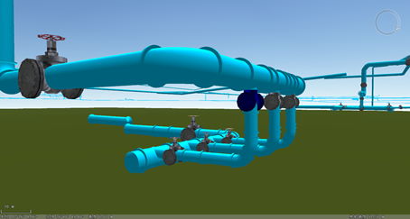
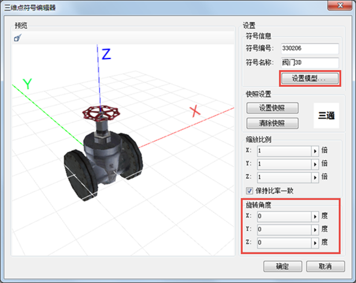
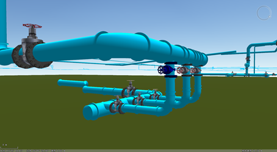

---
id: AdaptiveValve
title: 自适应阀门  
---  
### 使用说明

对于具有复杂外形结构的阀门，可采用模型符号来表示，但在三维场景中，管线的走向在X、Y、Z三个方向发生着变化，阀门也需要根据管线的走向来“自适应”地调整角度。若忽略模型角度的影响，将造成与现实场景背离的情况：阀门底部管道不能与管线衔接，阀门开关被管道覆盖，如下图所示：  

  
 
为解决这个问题，可通过以下步骤设置阀门管点与管道的自适应衔接：

  1. 新建三维点符号，点击“设置模型”选择自制模型文件（*.sgm 或 3ds 文件）作为阀门模型。 

   **注意**：制作阀门模型时，阀门底部管道应沿X轴方向，阀门开关则沿Z轴方向。若制作的模型符号方向与此设置不一致，需设置旋转角度，使其底部管道沿X轴，开关沿Z轴，下图为新建三维点符号（底部管道沿X轴，开关沿Z轴）。  
  

  2. 管点图层制作自定义专题图，指定某属性字段作为专题图的符号风格；
  3. 将管点专题图层的管道图层参数设置为模型匹配管线模式。
  4. 设置后阀门模型将根据管线走向自适应调整角度，即：阀门的底部管道沿管线方向，而阀门的开关则垂直于管线方向，实现效果如下图所示：     
  

  

