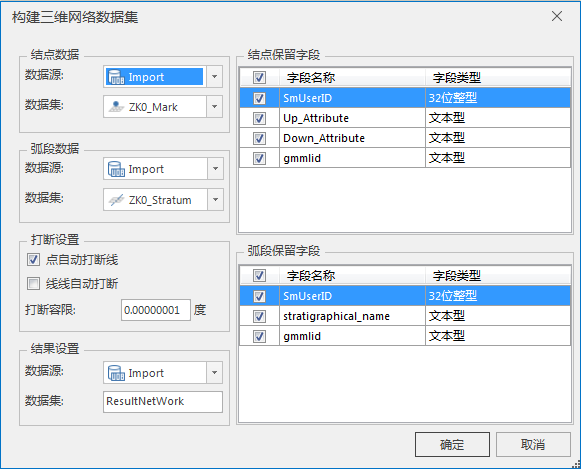
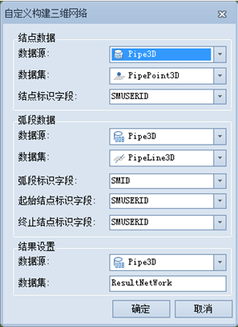

---
id: BuildPipeline
title: 构建三维网络数据集  
---  
### 使用说明

传统的以二维平面展现网络数据的方式，在一定程度上限制了信息的表达，尤其是在复杂的空间位置关系上，从而不可避免地影响了网络分析的准确性和可用性。三维网络是对现实中的网络的真实模拟，而非抽象模拟，因此能够全方位的展现信息。

例如，多层结构的建筑物内的通道数据（包括楼道、楼梯和电梯等），在二维显示上无法直观地区分各楼层的通道，而从三维视图上，则可以清晰直观地了解各个楼层的通道分布情况。再如，种类繁多且纵横交错的城市管网，仅通过二维数据难以清晰地表达管线的实际布设情况。二维数据中相交的两条管线，可能实际上并没有交叉，而只是架设的高度不同。而三维管网则能够直观的表达管线的布设、空间位置关系和拓扑关系，如下图所示。    
  

在三维管线场景中使用的数据是三维网络数据集，三维网络数据集是进行三维网络分析的数据基础，并且要使用自适应管点符号，必须首先构建三维网络数据集。在中，提供了两种生成三维网络数据集的方式，分别为构建三维网络和自定义构建三维网络。

构建三维网络数据集前，需要准备用于构建网络数据的数据集。可用于构建网络数据的数据类型包括点数据集、线数据集和网络数据集。其中点数据是可选的，在不选择点数据的情况下，也可以构建网络数据集；当网络数据集参与构建时，相当于利用其他点、线数据对该网络数据进行重新构网。
**注意** ：用于构建三维网络数据集的数据必须具有相同坐标系，否则构建失败。

### 构建三维网络

此方式适用于根据三维点和线数据集，或者三维点和网络数据集，或者三维线数据集生成三维网络数据集。

**操作步骤：**

  1. 在“ **交通分析** ”选项卡的“ **路网分析** ”组中，单击“ **拓扑构网** ”下拉按钮，选择“构建三维网络”，弹出如下图所示的“构建三维网络数据集”对话框：   
   
“构建三维网络数据集”对话框  
  2. 源数据选择 
      * 在“结点数据”处选择参与构网的三维点数据集及其所在的数据源。注：三维点数据集可设置为空，仅通过三维线数据集进行构网。
      * 在“弧段数据”处选择参与构网的三维线数据集及其所在的数据源。 
  3. 保留字段选择 
      * “结点保留字段”列表中列出了结点数据的所有字段信息，可通过复选框勾选参与构建网络数据集的属性字段；默认勾选所有字段。
      * “弧段保留字段”列表中列出了弧段数据的所有字段信息，可通过复选框勾选参与构建网络数据集的属性字段。默认勾选所有字段。
  4. 打断设置 
      * 点自动打断线：勾选该复选框后，在容限范围内，线对象会在其与点的相交处被打断，若线对象的端点与点相交，则线不予打断。
      * 线线自动打断：勾选该复选框后，在容限范围内，两条（或两条以上）相交的线对象会在相交处被打断，若线对象与另一条线的端点相交，则这个线对象会在相交处被打断。此外，勾选“线线自动打断”操作时，系统会同时默认勾选“点自动打断线”，即“线线自动打断”功能不可以单独使用。 
      * 打断容限：设置打断容限。打断容限即结点容限，表示线对象与线对象、线对象与点对象之间的最小距离。例如，若一个线对象的节点与另一个线对象的节点距离在容限范围内，则认为这两个节点重合；若一个线对象的节点与一个点对象的距离在容限范围内，则认为点在线上。 
      * 容限的默认值为数据集左右范围的1/1000000，若有多个数据集参与构建网络数据集，则以左右范围最大的数据集为参考计算容限的默认值。容限单位与数据集的单位相同，推荐使用默认容限。
  5. 结果设置：选择结果数据集所在的数据源，同时可修改结果数据集的名称。数据集默认名称为ResultNetWork。 
  6. 单击“确定”按钮，即可执行网络数据集的构建，构建完成后将自动关闭“构建网络数据集”对话框。

**自定义构建三维网络**

此方式适用于根据已存在拓扑关系的三维点、线数据集生成三维网络数据集。

**操作步骤：**

  1. 在“ **交通分析** ”选项卡的“ **路网分析** ”组中，单击“ **拓扑构网** ”下拉按钮，选择“自定义构建三维网络”。弹出如下图所示的“自定义构建三维网络数据集”对话框：      

  2. 结点数据：选择三维点数据集及其所在的数据源，同时设置结点数据的“结点标识字段”。 
  3. 弧段数据：选择三维点数据集及其所在的数据源，并设置弧段数据的“弧段标识字段”、“起始结点标识字段”和“终止结点标识字段”。
  4. 结果设置：选择结果数据集所在的数据源，同时可修改结果数据集的名称。默认数据集名称为ResultNetWork。
  5. 单击“确定”按钮，即可执行网络数据集的构建，构建完成后将自动关闭“自定义构建三维网络”对话框。

  

