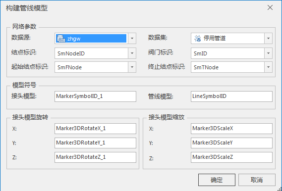

---
id: BuildPipelineModel
title: 构建管线模型  
---  
### 使用说明

构建管线模型功能可根据三维网络数据集相关参数字段，构建接头模型、管线模型、接头模型旋转及接头模型缩放等相关字段，用于匹配符号库中的接头结点符号和管线符号。

### 操作步骤

  1. 在“ **环境设置** ”窗口中，单击"管线模型设置"下拉按钮，选择“构建管线模型”选项，弹出“构建管线模型”对话框，如下图所示：       
  

  2. 在对话框的“网络参数”处，选择用于构建管线模型的三维网络数据集，及其所在的数据源。
  3. 设置构建管线模型所需的字段信息，包括结点标识字段、阀门标识字段、起始结点标识字段、终止结点标识字段。
  4. 在“模型符号”处设置“接头模型”和“管线模型”字段名称。其中，接头模型字段信息中存储了各个接头对应的符号编号；管线模型字段中存储了管线弧段对应的模型符号编号。
  5. 在“接头模型旋转”的 X、Y、Z 右侧文本框中，可设置接头模型旋转名称，分别存储接头符号旋转的角度值；在“接头模型缩放”的 X、Y、Z 右侧文本框中，可设置接头模型缩放名称，分别存储接头符号的缩放比例。
  6. 单击“确定”按钮，即可创建接头模型、管线模型、接头模型旋转及接头模型缩放等相关的字段信息，用于构建地下管线模型图层数据。

  

