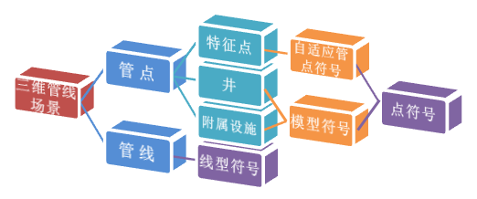

---
id: Pipe3D
title: 三维管线  
---  
### 概述

地上地下各类管网、管线是一个城市重要的基础设施，它不仅具有规模大、范围广、管线种类繁多、空间分布复杂、变化大、增长速度快、形成时间长等特点，更重要的它还承担着信息传输、能源输送、污水排放等与人民生活息息相关的重要功能，也是城市赖以生存和发展的物质基础。

随着我国城镇化进程的不断深入，传统的二维管理模式已根本无法满足对管网、管线大数据信息分析、表达、应用的实际需要，三维管线管理逐渐替代二维管理模式。二维系统只有点、线表示管网，系统建设成本并不高，但是在三维场景中，需要使用三维管点模型、管线模型来展示管网系统，模型建设成本较高，管点模型的管口与管线管道的匹配效果差，并且业务属性信息需要从点、线数据集中再次录入到三维模型中，同时维护两套数据而无法满足实时更新的需求。

基于此，超图软件SuperMap GIS
8C版本新增基于二三维一体化技术的自适应管点符号，可由二维的点、线数据集生成三维网络数据集，根据管网走向、管线截面自动实时放样出管点符号模型，快速构建三维场景的同时大幅降低三维管网场景的建设成本，并且提高了三维管线、三维管点的显示性能，系统资源占用减少使得数据承载力大幅提升，进而满足更加庞大复杂的三维管网系统展示、管理及应用。

### 三维管线场景的组成

三维管线场景通常由三维管线和三维管点两类组成，具体包括以下元素：

  * 管线：包括圆管、方沟、管块、竖管等；
  * 管点：包括特征点、井和附属设施三大类；
    * 特征点：包括弯头、直通、三通、四通、五通、多通、变径、盖堵、管帽等；
    * 井：包括方井、圆井、井室、偏心井、雨篦等;
    * 附属设施：包括阀门、水表、消防栓、控制柜、变压器、分线箱等；

不同元素采用不同方式实现快速构建三维管线场景，如下图三维管线场景组成及展示方式所示。通常采用线型符号构建三维管线、自适应管点符号构建三维管点，而部分特殊特征点、井和附属设施采用模型符号展示。其中采用自适应管点符号方式构建特征点是
SuperMap GIS 8C 新增的功能,下图为三维管线场景组成及展示方式。   

  

  
### 相关主题：

 [构建三维网络数据集](BuildPipeline)

 [构建管线模型](BuildPipelineModel)

 [构建三维管线场景](PipeStyle)

 [自适应阀门](AdaptiveValve)

 [加载三维管线数据集](AddPipeline)

 [常见问题解答](PipeFAQ)

  

