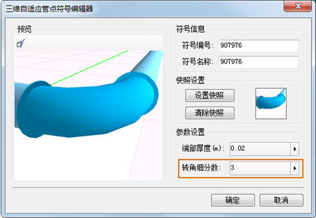

     问：为什么场景中不显示管网数据？

**答：** 请将图层的高度模式设置为“绝对高度”，如果管网数据位于地下，请设置数据来自“地下”，并“开启”地下和设置透明度。 

--- 

    问：为什么在管线场景中鼠标稍微一拖动，管线大块大块的消失？

**答：** 检查图层属性中的“更新瓦片数”是否设置的太小，此属性决定了图层每次更新的瓦片块数，设置过小将导致调度的块很大，很容易从场景中调度出去，建议设置为16。

---  
    问：为什么设置的圆管看起来不圆？ 

**答：** 请在“三维线型符号编辑器”中制作圆管符号时，去掉“自动打断”选项。此自动打断选项会把参数化的圆转化为多边形存储，造成精度损失。

----  
    问：怎么提高管线场景的渲染性能？ 
**答：** 
* 修改管线图层风格中的GeoStyle3D.TubeSides属性，在不需要管线特别圆滑的情况下将其设置的小一些（默认值20），可以减少管线模型的复杂程度；
* 弯头、三通、四通等特征点尽量使用自适应管点符号，可以提高渲染效率；
* 修改自适应管点符号的转角细分数，在满足视觉要求的情况下尽可能设置的小一些。
     
---
    问：构建三维网络数据集时出现点丢失或构建结果明显错误情况？
**答：** 
检查构建三维网络数据集时设置的“打断容限”值，打断容限表示线对象与线对象、线对象与点对象之间的最小距离，设置过大将出现错误，建议设置为0.001以下，推荐使用默认数值。  
  

