针对三维管线场景中的不同元素，可采用不同方式实现快速构建三维管线场景，通常采用三维线型符号构建三维管线、自适应管点符号构建三维管点，而部分特殊特征点、井和附属设施则采用三维点符号展示。在桌面添加三维管线数据后，新建或导入自适应管点符号后，设置三维点、线符号，即可构建出显示效果真实、美观的地下三维管线场景。具体操作如下：

###   一、 添加三维管线数据

1. 选中已构建好的三维网络数据集，在右键菜单中选择“添加到新的球面场景”中。
2. 在图层管理器中，分别选中三维网络数据集的管线和管点图层，在“风格设置”选项卡中，设置图层 “ **高度模式** ”为 **绝对高度** ，如果数据来源于地下，设置“ **数据来自** ”为 **地下** 。
3. 在“场景”选项卡中的“地下”分组中，设置为“开启”地下模式，并设置“透明度”为50%即可。

**注意** ：管线、管点图层设置的高度模式和数据来源需保持一致，否则高程不一致会导致管线和管点不能正确显示。

###   二、 新建三维管线、管点符号

**2.1 新建自适应管点符号**

自适应管点自动生成技术是在SuperMap GIS
8C中新加入的特性，引入该技术可以解决场景中的弯头、三通、四通等管点与管线的匹配问题。由于三维网络数据集保存了结点与哪些弧段相连的拓扑信息，根据这些拓扑信息，结点可以自动生成与管线相接的弯头、三通、四通等管点符号。

 1. 在“工作空间管理器”的“资源”双击“点符号库”或右键选择“加载点符号库”，打开“点符号选择器”对话框；
 2. 单击“ **编辑** ”下拉按钮，在“新建符号”右拉菜单中选择“新建三维自适应符号...”，打开“三维自适应管点符号编辑器”对话框；  
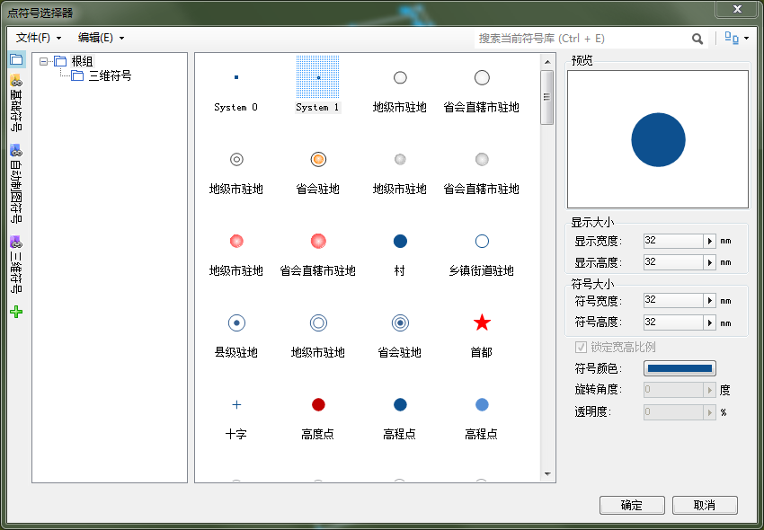   
  
 3. 参数设置 
      * **端部厚度** ：表示管点符号的箍的长度，当设置该参数值为“0”时，表示该符号不带箍；
      * **转角细分数** ：表示管点符号弯头的平滑度，数值越大，弯头效果越平滑。
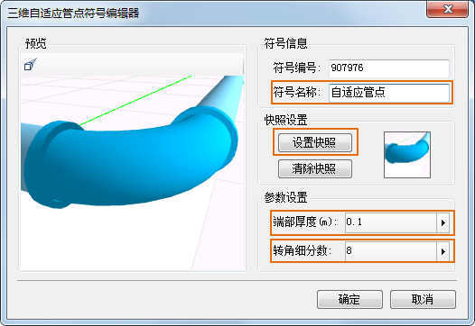  
 
 4. 修改“符号名称”和“设置快照”后，点击“确定”按钮即可完成三维自适应符号的新建。

### 2.2 新建三维点符号

 1. 在“工作空间管理器”的“资源”双击“点符号库”或右键选择“加载点符号库”，打开“点符号选择器”对话框；
 2. 单击“ **编辑** ”下拉按钮，在“新建符号”右拉菜单中选择“新建三维符号”，打开“三维点符号编辑器”对话框；
 3. 点击“设置模型”按钮，弹出“打开”对话框，选择一个自制模型文件（*.sgm 或 3ds 文件），并确定打开；
 4. 设置“缩放比例”和“转角度”，可使用默认数值；  
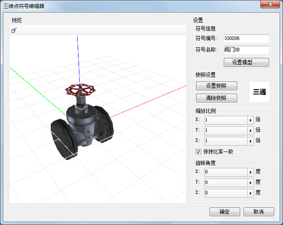   

 5. 修改“符号名称”后，单击“设置快照”按钮，设置符号的快照图片，点击“确定”即可完成三维点符号的新建。

### 2.3 新建三维线型符号

 1. 在“工作空间管理器”的“资源”双击“线型符号库”或右键选择“加载线符号库”，打开“线型符号选择器”对话框；
 2. 单击“ **编辑** ”下拉按钮，在“新建符号”右拉菜单选择“新建三维线型”，打开“三维线型符号编辑器”对话框；  
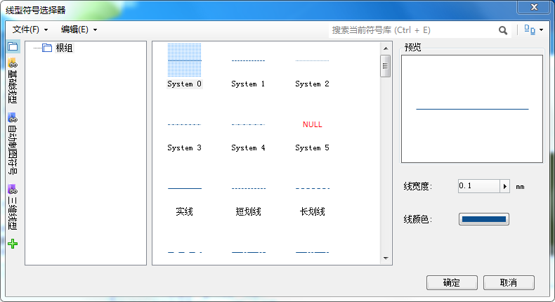  

 3. 在“截面列表”选择圆形截面，设置“线宽”、“线颜色”后，修改“符号名称”等信息；  
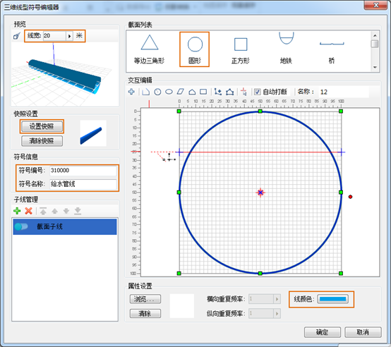  

 4. 单击“设置快照”按钮，设置快照图片之后，点击“确定”按钮即可完成三维线型符号的新建。

###   三、 构建地下管线场景

**3.1 三维管线线的构建**

根据实际场景中管线的复杂程度，通过配置管线符号构建三维管线分为两种方式：

* 通过设置管线图层的图层风格使用一种管线符号；
* 通过创建自定义专题图使用两种或两种以上的管线符号。

**使用一种管线符号**

  1. 在图层管理器中选择管线图层，单机鼠标右键选择“图层风格”，打开“线型符号选择器”对话框；
  2. 在“线型符号选择器”中选择“三维线型”，点击所要设置符号，可根据情况更改符号的“线宽度”和“线颜色”；  
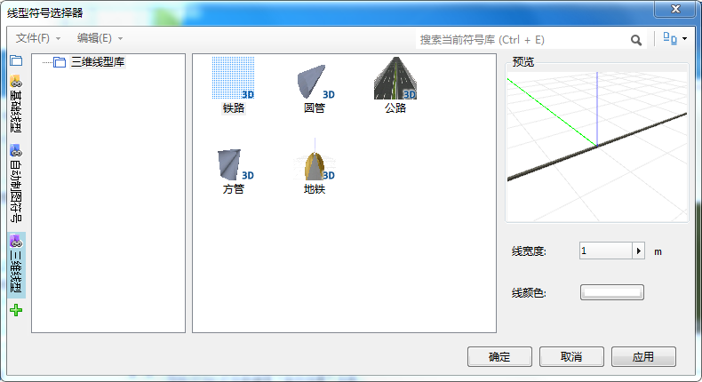  

  3. 设置好三维管线的线型符号后，SuperMap GIS 8C版本将显示默认自适应管点符号。默认的自适应管点符号颜色与管线颜色一致，带箍，箍长度为0.015米，弯头管点拐弯处为尖角，如下图。  
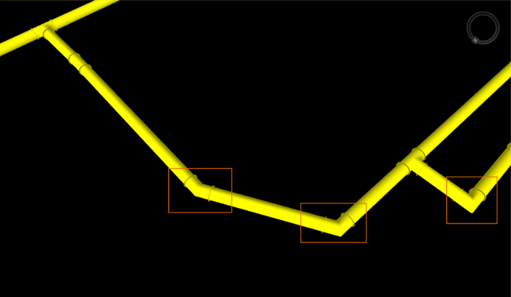   
**注意** ：
      * 图层上线宽度的最小值为0.1米，设置更小的值将被当做0.1米处理。
      * 如果需要指定比0.1米更小的管线宽度，可设置线型符号在横向、纵向缩放比例的字段名称，可分别设置每条管线的横向、纵向缩放比例。
      * 建议使用时指定管线宽度为1，然后通过管线的横向、纵向缩放比例控制管线的实际线宽。 

**使用多种管线符号**

如果一个图层的管线所使用的线型符号、颜色和线宽不同，可通过制作三维自定义专题图来实现多类型的线型符号。

 1. 在图层管理器中选中管线图层，单击鼠标右键选择“制作专题图”，并在打开的“制作专题图”对话框中选择“自定义专题图”；
 2. 设置专题图线型 
     * “线型风格”：设置存储线型风格的字段；
     * “线型颜色”：设置存储线型颜色的字段；
     * “线型宽度”：设置存储线型风格的字段；  
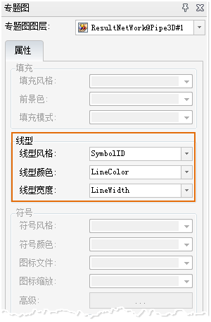  

 3. 选中新建的专题图，在“风格设置”选项卡中，将“高度模式”设置为：绝对高度，“数据来自”设置为：地下。

**注意事项**
  * 虽然SuperMap GIS支持任意形状的线型符号截面，建议使用左右对称的线型符号，否则会出现管线与弯头、三通等管点无法对齐的问题。
  * 通过“三维线型符号编辑器”制作线型符号时，如果制作圆形截面的管线，不勾选“自动打断”选项，可以改善渲染效果和提升渲染性能。  
  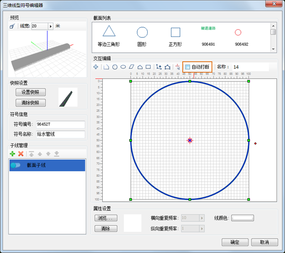  

  
### 3.2 三维管点的构建

三维管点分为特征点、井和附属设施三大类别的要素，SuperMap
新增采用自适应管点符号方式构建直通、三通、四通、弯头等特征点，而部分特殊特征点、井和附属设施继续采用模型符号展示这类具有复杂结构、特殊外表的管点。

根据实际场景中管点符号的复杂程度，通过配置管点符号构建三维管点分为两种方式：

**使用一种管点符号**

当一个图层的所有管点使用一种管点符号时，只需要设置管点图层的图层风格为管点符号即可。

  1. 选择管点图层，右键选择“图层风格”，打开“点符号选择器”对话框；
  2. 在“点符号选择器”中选择“三维模型”，选择新建的自适应管点符号；
  3. 管点使用自适应管点符号前后对比效果如下图：  
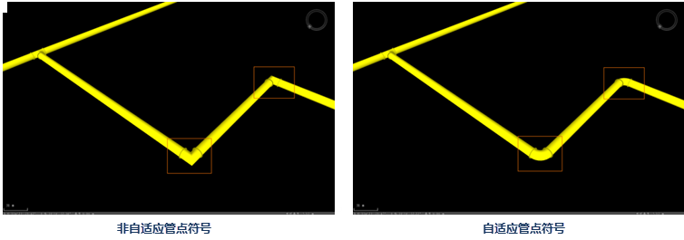  
  
**使用多种管点符号**

对于管点图层，井、阀门、变电箱等这一类具有复杂结构、特殊外表的管点，通常采用模型符号。那么如何使得管点图层有的能显示为自适管点，有的显示为模型符号呢？即通过使用三维自定义专题图(Theme3DCustom类)，三维自定义专题图允许用户为专题图层指定若干字段，利用图层中每个对象的字段值来表示这个对象的显示特征，可设置其模型符号、旋转、缩放、颜色等属性。

通过制作自定义专题图，根据符号ID的值显示为不同类型管点，符号ID取值有以下几种情况：

 * 当管点为直通、三通、四通、弯头等特征点时，显示为自适应符号，符号ID设为已创建的自适应管点符号编号或设为0；
 * 当管点为阀门、消防栓、井等特殊管点时，显示为模型符号，符号ID设为符号库中已存在的模型符号编号；
 * 当管点为普通管段时，符号ID设为-1。

**注意** ：由于专题图没有存储网路拓扑关系，使用自定义专题图构建自适应管点时，设置管点图层的父图层为对应的管线图层。

  1. 在图层管理器中选中管点图层，单击鼠标右键选择“制作专题图”选项，打开“制作专题图”对话框，选择“自定义专题图”；
  2. 设置专题图属性 
      * “符号风格”：设置存储符号风格的字段；
      * “模型符号旋转”:设置存储符号旋转参数的字段；
      * “模型符号缩放”: 设置存储符号缩放参数的字段；  
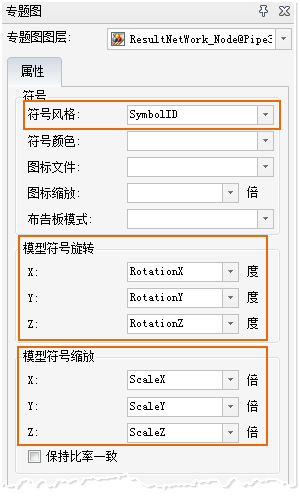  

  3. 选中新建的专题图，在“风格设置”选项卡设置“高度模式”为绝对高度，“数据来自”地下。

 

