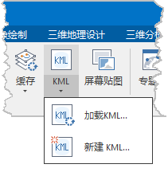
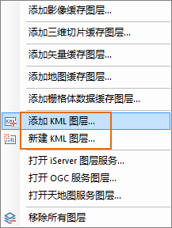
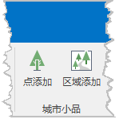
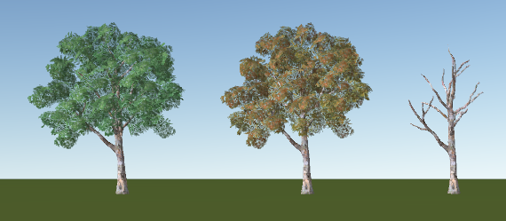

**使用说明**

城市小品即是种树功能，它可以依据地形或模型的起伏状态进行种植树木，使得树木能够紧贴地形或模型表面。种树功能是基于对KML图层的编辑，平台提供了点添加和区域添加功能，便于用户进行细致或大区域范围的场景美化，主要过程如下：

1. 激活城市小品功能

打开或新建KML图层，开启图层“可编辑”状态，使得城市小品功能激活。

2. 点添加/区域添加

根据场景需求进行单点或区域种树。

3. 保存数据

保存KML数据或内存数据源。

**操作步骤**

#### 激活城市小品功能

* 打开需要种树的三维场景，在“场景”选项卡中点击“KML”下拉按钮，选择“加载KML”/“新建KML”；或选择“图层管理器”的“普通图层”点击右键，选择“添加KML图层”/“新建KML图层”，实现添加或新建一个kml图层。  
    

* 在“图层管理器”中选中KML图层，图层激活“可编辑”状态，此时，菜单选项卡自动转到“对象绘制”，种树功能位置如下图，程序提供了“点添加”和“区域添加” 两种方式。   
   

#### 点添加

鼠标每点击一次则在鼠标点击处种下一棵树，可连续点击实现种下多棵树。通过“点添加”功能可以对三维场景实现精确、细致的美化。

* 点击“点添加”按钮，弹出“种树类型设置”对话框，如下图所示。   
  

* **选择树类型** ：勾选此项目，直接点击右侧下拉按钮选择由程序提供的树类型。程序提供了“春天树”、“秋天树”、“冬天树”三种树类型，如下图依次为春天树、秋天树、冬天树。  
   

* **其他树类型** ：勾选此项目，用户可添加自定义树木类型，支持添加*.sgm、*.3ds、*.osgb、*.X、*.obj、*.dae、*.mesh、*.ogb格式的模型文件。单击右侧浏览按钮，弹出“打开”对话框，找到资源后单击“打开”按钮；也可以在文本框中直接输入资源所在路径名称。
* 点击“确定”，鼠标变为加号，在场景中单击鼠标左键，鼠标每点一次则种上一棵树。点击鼠标右键结束绘制。   
  

#### 区域添加

区域添加则是在场景中绘制一个多边形区域，程序按指定的行/列间距均匀地种上多棵树。通过“区域添加”可以快速、便捷地对一个大区域场景进行美化。

* 点击“区域添加”按钮，弹出“种树密度及类型设置”对话框，如下图所示。   
  

* **行间距（米）** ：用于设置该区域树的行间距，默认间距为10米。
* **列间距（米）** ：用于设置该区域树的列间距，默认间距为10米。
* **树类型** ：与点种树操作一致，详情参见“点种树”。
* 单击“确定”按钮，鼠标变为加号，在场景中绘制一个多边形区域，点击鼠标右键结束绘制。程序将在该多边形区域内批量种植树木。   
  

#### 保存数据

* **保存KML** ：编辑完成后，在“图层管理器”中选择KML图层，单击右键选择“保存”选项，程序将保存当前添加的树木。
* **保存数据源** ：进行区域种树操作时，程序自动在当前工作空间创建了一个“UntitledDatasource”的数据源以及如下点/面数据集。 
    * 点数据集oldPoints：形状为区域种树所绘区域的最小外接矩形，点按种树时指定行列间距排列。
    * 面数据集region：为区域种树时所绘的多边形面。
    * 点数据集newPoints：形状为最小外接矩形减去绘制多边形，点按种树时指定行列间距排列。

该自动生成的数据源为内存数据源，不支持直接保存。若有保存需要，可通过“复制数据集”的方式将其复制到本地的数据源进行存储。场景加载这些点数据集可通过设置“图层风格”来实现树木表达。

**注意事项**

1. KML图层在“可编辑”状态下才可进行种树操作。 
2. 完成种树后，请保存KML图层，否则数据将丢失。

