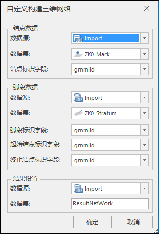

---
id: AccurateBuildNetwork3D
title: 自定义构建三维网络数据集  
---  
### 使用说明

若三维点、线数据集中的点、线对象分别对应着待构建网络的结点和弧段，并具有描述二者空间拓扑关系的信息，即三维线数据集含有弧段 ID、弧段起始结点 ID
和终止结点 ID 的字段信息，三维点数据集含有点对象的结点 ID 字段信息时，可以采用该方法构建三维网络数据集。

使用此方式构建三维网络数据集成功后，结果对象数与源数据的对象数一致，即线数据中一个线对象作为一个弧段写入，点数据中一个点对象作为一个结点写入，并且保留点、线数据集的所有非系统字段到结果数据集中。

### 操作步骤

1. 在“ **交通分析** ”选项卡的“ **路网分析** ”组中，勾选“ **拓扑构网** ”下拉按钮，选择“ **自定义构建三维网络** ”。
2. 弹出如下图所示的“自定义构建三维网络数据集”对话框。    

3. **结点数据** ：选择三维点数据集及其所在的数据源，同时设置结点数据的“结点标识字段”。
4. **弧段数据** ：选择三维点数据集及其所在的数据源，并设置弧段数据的起始结点标识字段、终止结点标识字段、弧段标识字段。
5. **结果设置** ：选择结果数据集所在的数据源，同时可修改结果数据集的名称。
6. 单击“确定”按钮，即可执行网络数据集的构建，构建完成后将自动关闭“自定义构建三维网络”对话框。

###  注意事项

1. 用于构建三维网络数据集的数据必须具有相同的坐标系，否则构建失败。
2. 结点数据的结点标识字段不支持选择 SmID，SmID 为系统字段，若结点数据数据有更新或复制，每天记录的 SmID 的字段值会有变化，若以该字段作为结点标识字段，则结点与弧段的关联关系也会发生变化，导致结点与弧段构建的网络数据集有错。弧段标识字段不会影响结点数据与弧段数据的构网情况。
3. 自定义构网构建的网络数据集的弧段 ID、弧段起始结点 ID、弧段终止结点 ID 和结点 ID 字段，为设置参数时指定的字段，而不再是 SMEDGEID、SmFNode、SmTNode、SMNODEID 等系统字段。

