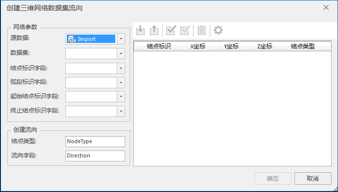
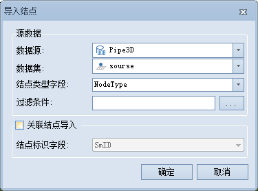

**使用说明**

根据指定的源点和汇点的位置，为三维网络数据集创建流向。流向字段根据源汇信息字段计算而来。创建流向以后的三维网络数据集才可以进行各种设施网络分析。

**操作步骤**

1. 在“ **交通分析** ”选项卡中的“ **路网分析** ”组内勾选“ **环境设置** ”复选框，在弹出的“ **环境设置** ”窗口中，单击"创建流向"下拉按钮，选择“三维网络创建流向”选项，弹出“创建三维网络数据集流向”对话框，如下图所示：  
   

2. 在“创建三维网络数据集流向”对话框中，选择需要创建追踪分析流向的三维网络数据集，并设置该网络数据集的结点标识字段、弧段标识字段、起始结点标识字段和终止结点标识字段。
3. 在“创建流向”处，设置结点类型字段的名称以及流向字段。默认生成的结点类型字段名称为 NodeType ，用来存储导入的结点类型。其中数值为0表示该点为普通结点；1表示该点为源点；2表示该点为汇点。
4. 在右侧的工具栏处单击“导入”按钮，弹出“导入结点”对话框。在该对话框中设置导入源点与汇点相关的参数。
5. 导入成功后，可以直接单击“结点类型”列，对各个点的结点类型进行修改。支持普通结点、源点和汇点三种类型，默认结点类型为源点。
6. 单击结点列表中的结点记录，可定位到相应的结点，在当前场景中居中高亮显示。
7. “创建三维网络数据集流向”对话框中的工具条提供了对源点和汇点进行操作时的常用功能，如导入和导出源点与汇点，全选、反选，删除和统一为结点类型赋值的功能。  
工具条介绍  
    * **导入** ：导入源点和汇点数据，并进行参数设置。如下图所示为“导入结点”对话框：    

      - **数据源** ：要导入的源点和汇点所在的数据源。
      - **数据集** ：源点和汇点数据所在的数据集。
      - **结点类型字段** ：如果源点和汇点的类型已经设置好，已经保存在某一字段中，可以选择该字段，导入点的时候，会同时导入结点类型信息。
      - **过滤条件**：导入满足过滤条件的结点。可以直接输入表达式，也可以单击旁边的浏览按钮，使用“SQL表达式”对话框定义过滤条件。关于SQL表达式的使用，请参见[SQL表达式对话框](../Query/SQLDia  )页面。
      - **关联结点导入**：选中该复选框表示，使用一个关联字段导入结点。一些情况下需要使用网络分析的站点作为网络结点，则在导入的时候用户可以选择点数据集的一个字段作为关联字段，此字段与网络结点标识字段（内部关联字段）相关联，共同完成结点的导入。
      - **结点标识字段** ：与“环境设置”对话框中的结点标识字段一致。只有在选中“关联结点导入”复选框时，此参数可用。

    * **导出** ：将源点和汇点信息导出，并保存为点数据集。如下图所示为“导出结点”对话框：   
     

        - **数据源** ：导出的点要保存的数据源。
        - **数据集** ：导出的点数据集要保存的名称。
        - **结点类型字段** ：导出后结点类型字段的名称。
        - **结点标识字段** ：导出后结点标识字段的名称。
        - **仅保存选中的记录** ：选中该复选框表示，仅导出源点汇点设置区列表中选中的结点；否则将导出全部结点信息。

    * **全选** ：全部选择源点汇点设置区列表中的所有结点。
    * **反选** ：反向选择源点汇点设置区列表中的结点。
    * **删除** ：删除源点汇点设置区列表中的选中的结点。
    * **统一赋值** ：为当前选中的结点统一赋值，修改其结点类型。单击“统一赋值”按钮，在弹出的“统一赋值”对话框中，通过下拉箭头，修改其结点类型为源点、汇点或者普通结点。

8. 参数设置完成后，单击“确定”按钮，即可进行三维网络数据集流向创建操作。

**注意事项**

 1. 三维网络数据集创建流向时，不支持创建河流等级字段和环路设置。
 2. 若当前网络数据集只有一个子网，则只支持一源一汇计算网络数据集流向；若网络数据集中有多个不连通的子网，则支持多源多汇计算网络数据集流向。

 

