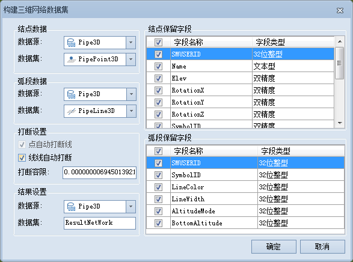

---
id: BuildNetwork3D
title: 构建三维网络数据集  
---  
### 使用说明

构建三维网络数据集功能可根据指定的三维点数据集、线数据集，或仅通过三维线数据集，生成三维网络数据集。该功能常适用于无拓扑关系字段的三维点、线数据集；若数据已存在拓扑关系，可通过该功能重新构建拓扑关系，也可用[自定义构建三维网络数据集](AccurateBuildNetwork3D)功能进行构网。

### 操作步骤

  1. 在“ **交通分析** ”选项卡的“ **路网分析** ”组中，单击“ **拓扑构网** ”下拉按钮，选择“构建三维网络”。
  2. 弹出如下图所示的“构建三维网络数据集”对话框。       

  3. **源数据选择**
      * 在“结点数据”处选择参与构网的三维点数据集及其所在的数据源， **注** ：三维点数据集可设置为空，仅通过三维线数据集进行构网。
      * 在“弧段数据”处选择参与构网的三维线数据集及其所在的数据源。
  4. **结果字段** ：“结点保留字段”列表中列出了结点数据的所有字段信息，可通过复选框勾选参与构建网络数据集的属性字段；“弧段保留字段”列表中列出了弧段数据的所有字段信息，可通过复选框勾选参与构建网络数据集的属性字段。默认勾选所有字段。
  5. **打断设置**
      * 点自动打断线：勾选该复选框后，在容限范围内，线对象会在其与点的相交处被打断，若线对象的端点与点相交，则线不予打断。
      * 线线自动打断：勾选该复选框后，在容限范围内，两条（或两条以上）相交的线对象会在相交处被打断，若线对象与另一条线的端点相交，则这个线对象会在相交处被打断。此外，勾选“线线自动打断”操作时，系统会同时默认勾选“点自动打断线”，即“线线自动打断”功能不可以单独使用。
      * 打断容限：设置打断容限，这里的打断容限即结点容限，表示线对象与线对象、线对象与点对象之间的最小距离。例如，若一个线对象的节点与另一个线对象的节点距离在容限范围内，则认为这两个节点重合；若一个线对象的节点与一个点对象的距离在容限范围内，则认为点在线上。 

容限默认值与数据集的坐标系有关，具体说明请参见[容限说明](../../DataProcessing/Tolerance)。

  6. **结果设置** ：选择结果数据集所在的数据源，同时可修改结果数据集的名称。
  7. 单击“确定”按钮，即可执行网络数据集的构建，构建完成后将自动关闭“构建网络数据集”对话框。

### 注意事项

用于构建三维网络数据集的数据必须具有相同的坐标系，否则构建失败。

