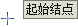
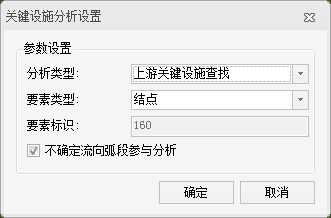

**使用说明**

关键设施分析可查找指定结点或弧段的最临近的上游或下游关键设施结点，及其影响到的下游弧段信息。若指定结点或弧段，有多个最临近上游或下游关键阀门，则分析结果将得到多个上游或下游结点。

在进行关键设施分析时，我们将设施网络的结点划分为普通结点和设施结点两类，其中设施结点认为是能够影响网络连通性的结点，例如供水管网中的阀门；普通结点是不影响网络连通性的结点，如供水管网中的消防栓或三通等。

可以查找某个爆管点最临近的上游或下游阀门结点，迅速找到上游或下游中需要关闭的最临近且最少数量的阀门。例如，供水管网发生爆管后，可以将所有的阀门作为设施结点，将发生爆裂的管段或管点作为分析弧段或分析结点，进行关键设施分析，迅速找到上游和下游中需要关闭的最少数量的阀门。关闭这些阀门后，爆裂管段或管点与它的上游不再连通，也防止下游管道中的水回流，从而阻止水的流出，防止灾情加重和资源浪费。同时，分析得出需要关闭的阀门的下游弧段的并集，也就是关闭阀门后的影响范围，从而确定停水区域，及时做好通知工作和应急措施。

**操作说明**

1. 在场景中打开用于分析的三维网络数据集。
2. 在“ **空间分析** ”选项卡的“ **设施网络分析** ”组中，选中“ **环境设置** ”复选框，弹出“ **环境设置** ”窗口。在此窗口中设置网络分析基本参数（如权重字段、结点/弧段标识字段等)、分析结果参数以及追踪分析的参数（设施网络分析需要设置）。关于环境设置窗口的介绍，请参见[网络分析环境设置窗口](../../Network/NetAnalystEnvironmentWIN  )页面。
3. 新建关键设施分析的实例。在“ **空间分析** ”选项卡的“ **设施网络分析** ”组中，单击“ **网络分析** ”下拉按钮，在弹出的下拉菜单中选择“ **关键设施** ”项。成功创建实例后，会自动弹出实例管理窗口。关于实例管理窗口的介绍，请参见[实例管理窗口](../../Network/InstanceWIN)页面。
4. 在当前网络数据图层中添加起始结点或弧段。有两种方式添加起始结点，一种是在网络数据图层中单击鼠标完成结点的添加；另外一种是导入点数据的方式，将点数据集中的点对象导入作为起始结点。   
添加起始结点

   - **鼠标添加**  
   在实例管理窗口的工具条中，单击“鼠标添加”按钮 ，地图窗口中鼠标状态变为
   ，可在在管网爆裂的管点（或管段）位置单击鼠标左键，添加为起始结点（弧段）。每添加一次，该点（弧段）会自动添加到实例管理窗口的起始结点（弧段）信息中。添加完成后，单击鼠标右键结束操作。  
   **注意** ：需要设置合适的结点捕捉容限。如果鼠标点击位置超出结点捕捉容限，则可能导致结点添加失败。

   - **导入起始结点**  
   将当前工作空间中的三维点数据集导入作为起始结点。在“实例管理”窗口中的树目录中，右键“起始结点”结点，在弹出的右键菜单中选择“导入”命令，具体操作请参见[导入站点](../../Network/ImportLocations  )对话框。  
   **注意**：若需要删除设施点，可选中“设施点”目录结点，在弹出的右键菜单中选择“移除”或者选中要删除的设施点按住 Delete 键即可。

5. 在网络分析实例管理窗口中单击“参数设置”按钮  ，弹出“关键设施分析设置”对话框，对关键设施分析参数进行设置。     
  
 
    * **分析类型** ：单击“分析类型”下拉箭头，选择关键设施分析类型。支持上游关键设施分析和下游关键设施分析两种。   
上游关键设施分析：分析结果为起始结点上游最临近的关键设施点，及关键设施点所影响到的所有下游弧段。  
下游关键设施分析：分析结果为起始结点下游最临近的关键设施点，及起始结点所影响到的所有下游弧段。

       * **要素类型** ：单击“要素类型”下拉箭头，选择要分析的要素类型。支持结点和弧段两种类型。当要素类型为结点时，表示选择网络结点作为分析要素；否则选择弧段作为分析要素。当要素类型为弧段时，实例管理窗口中右键菜单将不支持导入和导出功能。
       * **要素标识** ：分析要素的标识字段值。与环境设置窗口中的结点标识字段和弧段标识字段对应。关于环境设置窗口请参见[网络分析环境设置](../../Network/NetAnalystEnvironmentWIN  )页面。
       * **不确定流向弧段参与分析** ：勾选该复选框表示具有不确定流向的弧段仍然参与分析；否则，在分析时遇到不确定流向将停止在该方向上继续查找。流向字段的值为 2 时代表该弧段的流向为不确定流向。
6. 所有参数设置完毕后，单击" **空间分析** "选项卡中" **设施网络分析** "组的" **执行** "按钮或者实例管理窗口中“ **执行** ”按钮 ，操作完毕。分析结果会即时显示在地图窗口中。分析结果可以保存为数据集，以便在其他地方使用。

**注意事项**

1. 对于起始结点信息，可以将其导出成点数据集，以便以后进行类似分析时，直接导入使用。
2. 起始结点只能位于网络数据集的结点上，不能添加到网络弧段或其他区域中。
3. 若遇到以下三种情况，建议调整在“环境设置”面板中的结点捕捉容限值，容限值单位为米： 
    * 添加结点时，若未能将结点添加到指定位置，且与指定位置偏移较大；
    * 添加结点时，若输出窗口提示“添加失败：站点超出容限范围，不能作为分析点。”；
    * 鼠标移动选中结点时，未能将结点移动到指定位置，且与指定位置偏移较大。

**相关主题**

 [爆管分析](SquibAnalysis)

  

 

