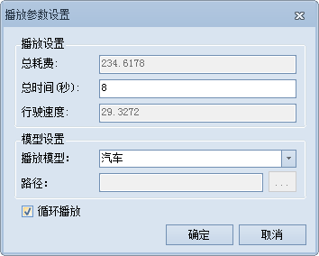

---
id: PathGuide
title: 行驶导引  
---  
行驶导引记录了三维最佳路径分析结果中的路径信息。一个行驶导引对象对应着一条从起点到终点的行驶路线。

### 具体操作

1. 在执行三维最佳路径分析功能前，单击“实例管理”窗口中的“参数设置”按钮，在弹出的设置窗口中勾选“开启行驶引导”复选框， 在执行网络分析功能完毕后，才可进行行驶导引操作。
2. 执行完最佳路径分析之后，在“实例管理”窗口的工具栏中，可单击 "开始"按钮，应用程序将以动画形式从起点开始到终点结束显示行驶路径；单击 "暂停" 按钮，模型符号将在路径上暂停行驶；单击 "停止"按钮，则停止播放行驶导引。  
  
3. 单击工具栏中的"播放参数设置"按钮，弹出"播放参数设置"对话框，用以设置行驶动画的各项参数（见下图）。   
  

    * **播放设置** ：

        * 总耗费：表示从起点至终点行驶的耗费值总和，单位为耗费单位。
        * 总时间：表示从起点行驶至终点所耗费的时间。
        * 行驶速度：模型的的行驶速度，单位为：耗费单位/每秒。

    * **模型设置** ：

        * 播放模型：单击右侧下拉按钮，可选择汽车、飞机预设模型作为播放动画模型，也可选择自定义方式，用本地的*.3ds模型文件作为播放符号。
        * 路径：当播放模型选择“自定义”时，可单击路径组合框右侧按钮，选择 3ds 模型文件所在路径，或直接在文本框中输入模型文件路径。

    * **循环播放** ：勾选该复选框后，在执行行驶导引播放时，将重复执行分析路线的播放操作，直到用户停止播放；若未选中该复选框，则执行播放操作时，只能播放一次从起始站点到终止站点的行驶导引路线。

4. 在播放行驶路径时，场景视角可随意调整，行驶导引播放效果如下图所示：     
  
  

