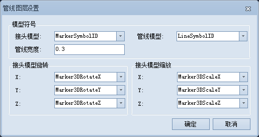

---
id: PipelineModelSetting
title: 管线图层设置  
---  
###  使用说明

管线图层设置功能用于重新指定管线模型数据接头和管线相关的字段，包括接头模型、管线模型、接头模型旋转及接头模型缩放等相关字段，同时，可设置管线宽度。

###  操作步骤

1. 在“ **环境设置** ”窗口中，单击"管线模型设置"下拉按钮，选择“管线图层设置”选项，弹出“管线图层设置”对话框，如下图所示：     
  

2. 在对话框的“模型符号”处，选择接头模型和管线模型信息所在的字段，通常选择在构建管线模型时，生成的接头和管线模型字段。
3. 在“管线宽度”右侧文本框中设置管线宽度，单位为：cm，默认宽度为 0.3 厘米。
4. 在“接头模型旋转”处，分别选择 X、Y、Z 旋转角度字段，设置接头符号在 X、Y、Z 三个方向的旋转角度。
5. 在“接头模型缩放”处，分别选择 X、Y、Z 缩放倍数字段，设置接头符号在 X、Y、Z 三个方向的缩放大小。
6. 参数设置完成后，单击“确定”按钮，即可完成管线模型图层的设置。

###  备注

可在图层管理器中分别选择接头和管线的自定义专题图，通过“修改专题图”的方式修改接头和管线模型图层的相关参数，实现管线模型设置。具体操作请参见[修改三维自定义专题图](../SceneVisualization/CustomizeMap3DGroupDia)。

  

