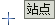
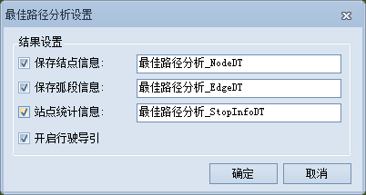

###   使用说明

最佳路径分析是指网络中两点之间阻力最小的路径，如果是对多个结点进行最佳路径分析，必须按照结点的选择顺序依次访问。阻力最小有多种含义，如基于单因素考虑的时间最短、费用最低、路况最佳、收费站最少等，或者基于多因素综合考虑的、路况最好且收费站最少等。三维最佳路径分析即按照指定的顺序经过一系列站点，分析得到花费最小的路径。

###   操作步骤

1. 在进行网络分析之前，先需要对网络分析环境进行设置。在“ **交通分析** ”选项卡的“ **路网分析** ”组中，勾选“ **环境设置** ”复选框，则弹出“ **环境设置** ”浮动窗口。在此窗口中对网络分析参数进行设置，如权值字段、结点/弧段标识字段等。关于环境设置窗口的介绍，请参见[网络分析环境设置窗口](../../Network/NetAnalystEnvironmentWIN  )页面。
2. 在“ **交通分析** ”选项卡的“ **路网分析** ”组中，单击下拉按钮，在弹出的下拉菜单中选择“ **最佳路径** ”项，创建一个最佳路径分析的实例。关于实例窗口的介绍，请参见[实例管理窗口](../../Network/InstanceWIN  )页面的介绍。
3. 在当前网络数据图层中单击鼠标选择要添加的站点位置。添加站点有两种方式，一种是在网络数据图层中单击鼠标完成站点的添加；一种是通过导入的方式，将点数据集的点对象导入作为站点。  
添加站点

   - **鼠标添加站点**  
   在实例管理窗口的工具条中，单击“鼠标添加”按钮  ，地图窗口中鼠标状态变为
   ，可在地图窗口中合适的位置单击鼠标左键添加站点。每添加一次站点，该点会自动添加到实例管理窗口的站点信息中。添加完成后，单击鼠标右键结束操作。  
   **注意** ：需要设置合适的结点捕捉容限。如果鼠标点击位置超出结点捕捉容限，则可能导致站点添加失败。

   - **导入站点**  
   将当前工作空间中的点数据集导入作为站点。在“实例管理”窗口中的树目录中，右击“站点”目录结点，在弹出的右键菜单中选择“导入”命令，具体操作请参见[导入站点](../../Network/ImportLocations)对话框。  
   **注意**：应用程序在进行最佳路径分析时，会按照网络分析实例管理窗口中每个站点的顺序依次进行。

4. 同样的添加方式，可以为路径分析设置障碍点。关于障碍点管理的相关内容，请参见[障碍点管理](../../Network/BarrierManagement)页面。
5. 在网络分析实例管理窗口中单击“参数设置”按钮 ，弹出“最佳路径分析设置”对话框，对分析结果的参数进行设置。    
  

   * **保存结点信息**  
   选择是否将分析结果经过的所有结点信息都保存下来。如果选中复选框，将结点信息保存为点数据集，并为其命名。该数据集将保存到网络数据集所在的数据源中。结点信息记录了结点的
   ID（NodeID）和结点所在结果路由的 ID（RouteID）。

   * **保存弧段信息**  
   选择是否将路径分析经过的所有弧段的信息保存下来。如果选择复选框，将弧段信息保存为线数据集，并为其命名。该数据集将保存在网络数据集所在的数据源中。弧段信息记录了结果路由的ID（RouteID）及结果路由所经过的弧段的
   ID （EdgeID）。

   * **站点统计信息**  
   选择是否保存站点统计信息。如果选中复选框，将站点统计信息保存为属性表数据集，并为其命名。该数据集将保存分析站点的一些统计信息，包括起始站点、终止站点、耗费、路由名称等。  
如下图所示，为一个站点统计信息属性表。表中记录了分析结果经过每个站点的顺序以及所用的耗费。字段 FromNode、ToNdoe 表示起始站点和终止站点，
Cost 字段表示相邻站点之间的耗费，Route 字段表示分析生成的路由名称。  
  

   * **开启行驶导引**  
   选择分析时是否生成行驶导引。行驶导引记录了交通网络分析结果中的路径信息，一个行驶导引对象对应着一条从起点到终点的行驶路线。勾选“开启行驶导引”复选框，则表示会输出分析结果的路径信息作为行驶导引的依据。关于行驶导引的介绍，请参见[行驶导引](PathGuide  )页面。

6. 所有参数设置完毕后，单击“ **分析** ”选项卡中“ **网络分析** ”组的“ **执行** ”按钮或者单击“实例管理”窗口的执行按钮  ，按照设定的参数，执行最佳路径分析操作。 

执行完成后，分析结果会自动添加到当前地图展示，同时输出窗口中会提示：“最佳路径分析成功。”。

**注意事项**

* 对于添加到站点目录树中的站点信息，可以将其导出为点数据集，方便以后进行类似网络分析时，直接导入即可使用。
* 站点必须位于网络弧段和网络结点上，或者在设定的容限范围的区域。可以在“分析环境”窗口中，对结点捕捉容限进行设置，修改合适的容限大小。
* 如需修改站点位置，可通过移动站点按钮 ，选中要移动的站点，拖动至合适的位置进行移动。
* 如果在网络分析图层中设置了障碍点，则障碍点信息在网络分析管理窗口中显示，并可以在该窗口中对障碍点进行管理。关于如何添加障碍点请参阅[障碍点管理](../../Network/BarrierManagement  )。
* 应用程序支持对多个网络分析实例同时进行管理。再次单击“网络分析”按钮，弹出的菜单中选择“最佳路径分析”，可创建一个新的最佳路径分析。在“实例管理”窗口中，通过下拉框的切换各个网络分析类型。如果不再需要某种分析实例，单击“删除实例”按钮  ，即可将当前实例删除，应用程序自动切换到下一个分析实例进行显示。
* 若遇到以下三种情况，建议调整在“环境设置”面板中的结点捕捉容限值，容限值单位为米： 
  * 添加站点时，若未能将站点添加到指定位置，且与指定位置偏移较大；
  * 添加站点时，若输出窗口提示“添加失败：站点超出容限范围，不能作为分析点。”；
  * 鼠标移动选中站点时，未能将站点移动到指定位置，且与指定位置偏移较大。

