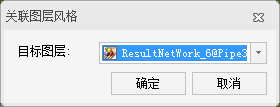
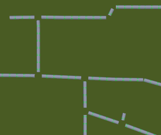
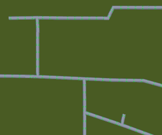

**使用说明**

关联图层风格功能可根据指定的管线图层，将管点数据生成自适应管点符号风格，管点会根据关联的管线图层，自适应管线的接头通数和角度。自适应管点的生成依赖于管点与管线之间的拓扑关系，该功能适用于三维网络数据集中的管点图层。

**操作步骤**

1. 将三维网络数据集添加到场景中，对网络数据的线图层设置图层风格或制作自定义专题图。
2. 在“ **图层管理器** ”中，选中三维网络数据的点图层，单击鼠标右键选择“关联图层风格...”选项，弹出“关联图层风格”对话框，如下图所示：  
  

3. 在对话框的“目标图层”组合框右侧，单击下拉按钮，选择被关联的线图层。
4. 单击“确定”按钮，即可完成结点图层风格的关联设置。此时场景中的点符号会根据关联的线数据的夹角和联通管线的条数，自适应调整管点符号的角度和联通数，如下图所示：   
      
