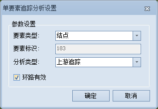

---
id: SingleTracing3D
title: 单要素追踪分析  
---  
### 使用说明

根据网络的走向，对设定的一个结点或者弧段进行追踪分析。

### 操作步骤

1. 打开用于网络分析的三维网络数据集。
2. 在“ **空间分析** ”选项卡的“ **设施网络分析** ”组中，选中“ **环境设置** ”复选框，弹出“ **环境设置** ”窗口。在此窗口中设置网络分析基本参数（如权重字段、结点/弧段标识字段等)、分析结果参数以及追踪分析的流向字段等。关于环境设置窗口的介绍，请参见[网络分析环境设置窗口](../../Network/NetAnalystEnvironmentWIN)页面。
3. 新建一个单要素追踪分析的实例。在“ **空间分析** ”选项卡的“ **设施网络分析** ”组中，单击“ **网络分析** ”下拉按钮，在弹出的下拉菜单中选择“ **单要素追踪** ”项。成功创建实例后，会自动弹出实例管理窗口。关于实例管理窗口的介绍，请参见[实例管理窗口](../../Network/InstanceWIN)页面。
4. 在网络分析实例管理窗口中单击“参数设置”按钮，弹出“单要素追踪分析设置”对话框，对分析参数进行设置。    
     

    * **要素类型** ：单击“要素类型”下拉箭头，选择要分析的要素类型。支持结点和弧段两种类型。当要素类型为结点时，表示选择网络结点作为分析要素；否则选择弧段作为分析要素。当要素类型为弧段时，实例管理窗口中右键菜单将不支持导入和导出功能。
    * **要素标识** ：分析要素的标识字段值。与环境设置窗口中的结点标识字段和弧段标识字段对应。关于环境设置窗口请参见[网络分析环境设置](../../Network/NetAnalystEnvironmentWIN)页面。
    * **分析类型** ：提供四种分析类型： 

        *  **上游追踪** ：根据指定的结点（或弧段）出发，根据流向，查找出该结点（或弧段）的所有上游路径。

        *  **下游追踪** ：根据指定的结点（或弧段）出发，根据流向，查找出该结点（或弧段）的所有下游路径。

        *  **查找源头** ：根据指定的结点（或弧段）出发，按照流向，查找流向该结点（或弧段）最近的源点。

        *  **查找汇点** ：根据指定的结点（或弧段）出发，按照流向，查找流出该结点（或弧段）的下游汇点。

    * **环路有效** ：设置分析的时候，网络环路是否参与分析。选中该项，表示环路参与追踪分析，否则不参与。

       参数设置完毕后，单击“确定”按钮，退出“单要素追踪分析”对话框。

5. 在当前网络图层中添加结点或者弧段。根据上一步设置的要素类型，添加结点或者弧段。添加结点与交通网络分析中添加站点的方式类似，即可以用鼠标添加，也可以通过导入的方式添加。添加弧段只能通过鼠标绘制的方式添加。

    添加起始结点

    * **鼠标添加结点**

       在实例管理窗口的工具条中，单击“鼠标添加”按钮 ，地图窗口中鼠标状态变为激活状态时，可在地图窗口中合适的位置单击鼠标左键添加结点。每添加一次结点，该点会自动添加到实例管理窗口的结点信息中。添加完成后，单击鼠标右键结束操作。
    **注意** ：需要设置合适的结点捕捉容限。如果鼠标点击位置超出结点捕捉容限，则可能导致添加结点失败。

    * **导入结点**

       将当前工作空间中的点数据集导入作为结点。在“实例管理”窗口中的目录树中，右击“结点”目录结点，在弹出的右键菜单中选择“导入”命令，弹出“导入”对话框。具体操作请参见[导入站点](../../Network/ImportLocations)对话框。

       注意：若需要删除某个结点，可在实例管理窗口中选中“结点”目录结点，在弹出的右键菜单中选择“移除”或者选中要删除的结点按住 Delete 键即可。

6. 所有参数设置完毕后，单击" **空间分析** "选项卡中" **设施网络分析** "组的" **执行** "按钮或者实例管理窗口中的“ **执行** ”按钮，进行分析。分析结果会即时显示在地图窗口中。分析结果可以保存为数据集，以便在其他地方使用。

###  注意事项

若遇到以下三种情况，建议调整在“环境设置”面板中的结点捕捉容限值，容限值单位为米：

* 添加结点时，若未能将结点添加到指定位置，且与指定位置偏移较大。
* 添加结点时，若输出窗口提示“添加失败：站点超出容限范围，不能作为分析点。
* 鼠标移动选中结点时，未能将结点移动到指定位置，且与指定位置偏移较大。
  

