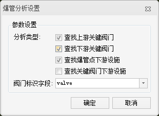
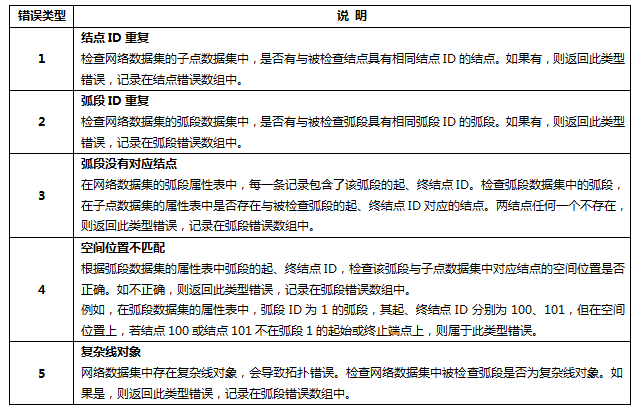

---
id: SquibAnalysis
title: 爆管分析  
---  
### 使用说明

爆管分析可用于查找爆管点上游或下游最近阀门位置，根据管道流向指示，迅速找到上游中需要关闭的最临近且最少数量的阀门。关闭这些阀门后，爆裂管段与它的上游不再连通，从而阻止水的流出，防止灾情加重和资源浪费。爆管点可位于弧段的任意位置。

创建爆管分析实例后，会自动开启地下模式，爆管喷水效果需将视角调整到地下才能看到，创建爆管分析时需要导入符号库，用于构建三维管线模型数据。

### 操作说明

1. 在场景中打开用于分析的三维网络数据集。
2. 在“ **空间分析** ”选项卡的“ **设施网络分析** ”组中，选中“ **环境设置** ”复选框，弹出“ **环境设置** ”窗口。在此窗口中设置网络分析基本参数（如权重字段、结点/弧段标识字段等)、分析结果参数以及追踪分析的参数（设施网络分析需要设置）。关于环境设置窗口的介绍，请参见[网络分析环境设置窗口](../../Network/NetAnalystEnvironmentWIN)页面。
3. 新建爆管分析的实例。在“ **空间分析** ”选项卡的“ **设施网络分析** ”组中，单击“ **网络分析** ”下拉按钮，在弹出的下拉菜单中选择“ **爆管分析** ”项。成功创建实例后，会自动弹出实例管理窗口，关于实例管理窗口的介绍，请参见[实例管理窗口](../../Network/InstanceWIN)页面。
4. 创建爆管分析时需要导入符号库，用于构建三维管线模型数据，符号库中包括管线流向符号、管线接头模型符号。 
      * 若三维网络数据集中存在接头模型和管线模型字段，导入符号库后，会根据接头模型、管线模型及接头模型旋转和缩放字段，分别创建两个自定义专题图，并在当前场景窗口中显示。
      * 若三维网络数据集中不存在接头模型和管线模型字段，可通过环境设置中的“构建管线模型”功能创建接头模型和管线模型等字段，并可通过“管线图层设置”功能，统一设置管线模型符号专题图的模型符号字段。详细操作请参考[创建管线模型](BuildPipelineModel)和[管线图层设置](PipelineModelSetting)。
5. 创建爆管分析实例后，会自动开启地下模式，且默认透明度为50%。
6. 在当前网络数据图层中添加爆管点。有两种方式添加爆管点，一种是在网络数据图层中单击鼠标完成爆管点的添加；另外一种是导入点数据的方式，将点数据集中的点对象导入作为爆管点。 

      添加爆管点

      *  **鼠标添加**

         在实例管理窗口的工具条中，单击“鼠标添加”按钮 ，地图窗口中鼠标状态变为激活状态，可在管网爆裂的管点位置单击鼠标左键，添加为爆管点。每添加一次，即会在该点处添加管网爆裂的喷水效果。添加完成后，单击鼠标右键结束操作。
      *  **注意** ：需要设置合适的结点捕捉容限。如果鼠标点击位置超出结点捕捉容限，则可能导致爆管点添加失败。

      *  **导入爆管点**

          将当前工作空间中的三维点数据集导入作为爆管点。在“实例管理”窗口中的树目录中，右键“爆管点”结点，在弹出的右键菜单中选择“导入”命令，具体操作请参见[导入站点](../../Network/ImportLocations)对话框。

7. 在网络分析实例管理窗口中单击“参数设置”按钮 ，弹出“爆管分析设置”对话框，对爆管分析参数进行设置。     
        

      * **分析类型** ：在“分析类型”处设置爆管分析的类型。支持查找上游关键阀门、查找下游关键阀门、查找爆管点下游设施、查找关键阀门下游设施四种分析类型。 
      * **查找上游关键阀门** ：查找爆管点上游最邻近的关键阀门。
      * **查找下游关键阀门** ：查找爆管点下游最邻近的关键阀门。
      * **查找爆管点下游设施** ：查找爆管点下游的所有弧段和结点。
      * **查找关键阀门下游设施** ：查找最近上游关键阀门及其所影响的下游弧段和结点。

      * **注意**：当勾选了“查找下游关键阀门”或“查找关键阀门下游设施”选项时，会自动勾选“查找上游关键阀门”选项，这两项分析类型需同时查找爆管点的上游关键阀门。

      * **阀门标识字段** ：用于选择结点数据集中的阀门标识字段，支持的字段类型为数值型，其中，大于 0 表示结点为阀门，小于等于 0 表示结点不是阀门。
8. 所有参数设置完毕后，单击“ **空间分析** ”选项卡中“ **设施网络分析** ”组的“ **执行** ”按钮或者单击“ **实例管理** ”窗口的“ **执行** ”按钮 ，即可执行爆管分析操作。 
9. 在执行分析时，程序会先对三维设施网络数据集进行检查，如果网络数据集出现如：结点ID重复、弧段ID重复、弧段没有对应节点、空间位置不匹配以及负责线对象等错误信息，程序会提示该网络数据集的弧段数据存在错误，错误信息会新生成一个名为“TopoArcErrorInfo”的数据集，加载该数据集便于用户针对错误信息对数据进行修改，以避免由于数据错误导致设施网络分析错误。详细错误信息说明如下表所示：     
10. 若网络数据集无误，则执行分析成功之后分析结果会即时显示在地图窗口中。分析结果可以保存为数据集，以便在其他地方使用。

### 注意事项

* 可将爆管点导出为三维点数据集，以便后续进行类似分析时，直接导入使用。
* 爆管分析每次仅能对一个爆管点进行分析。
* 若遇到以下情况，建议调整在“环境设置”面板中的结点捕捉容限值，容限值单位为米： 
* 添加爆管点时，若未能将爆管点添加到指定位置，且与指定位置偏移较大；
* 添加爆管点时，若输出窗口提示“添加失败：站点超出容限范围，不能作为分析点。

### 相关主题

 [构建网络模型](BuildPipelineModel)

 [管线图层设置](PipelineModelSetting)

  

