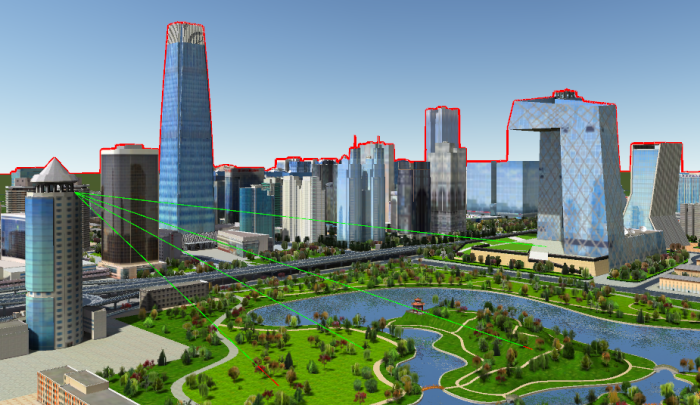

三维分析部分包含三维空间分析和模型出图。其中，空间分析是基于地理对象位置和形态的空间数据的分析技术，强大的空间分析能力是 GIS的主要特征。三维空间分析是指在三维场景中，基于地形、模型、影像等数据，对数据的位置和形态进行空间分析。

空间分析在真三维场景中的展现可以更加直观的表达出分析的效果。如下图所示，通视分析和天际线分析在场景中的展现效果。

  
  
应用程序提供的三维空间分析有坡度坡向分析、等值线分析、通视分析、可视域分析、动态可视域分析、天际线分析等等。本章节将重点介绍三维空间分析以及模型出图的内容和具体操作。

模型出图主要是指将当前场景中的三维数据生成DSM、DOM、2.5维地图以及立面图等。可为防灾治害和公共设施建设规划等应用提供可靠依据。

