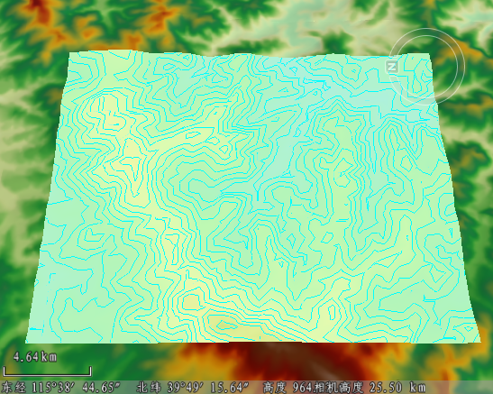

---
id: Contour
title: 等值线分析  
---  
### 使用说明

三维空间分析中的等值线分析功能，可根据栅格数据的像元值，提取指定区域的的等值线。用于等值线分析的数据集必须为 DEM 或 Gird 等栅格数据集。

### 操作步骤

1. 在场景中添加需进行等值线分析的栅格数据，单击“ **三维分析** ”选项卡上的“ **空间分析** ”组中的“ **等值线分析** ”按钮。
2. 当鼠标状态变为激活状态，即可在数据表面单击鼠标确定多边形起始位置，移动鼠标即可看到矩形范围内的等值线提取预览效果，并再次单击鼠标左键，确定等值线分析的矩形范围。 然后点击鼠标右键表示绘制结束。     
 

3. 确定等值线分析区域之后，可在“三维空间分析属性”工具栏中，继续添加等值线分析范围，或删除分析结果。

    工具条按钮说明

    * “绘制” 按钮：用来绘制参与等值线分析的矩形区域。
        * “选择”按钮：用于在场景中选择一个三维面作为分析区域。
        * “移除” 按钮：用来移除分析结果列表中选中的分析记录。
        * “导入” 按钮：用于导入参与分析的三维面数据集。
        * “导出” 按钮：用于导出分析区域。可勾选名称、最小可见高度、最大可见高度以及等值距等复选框进行设置。
4. 等值线分析可设置结果等值线的相关参数，包括显示模式、线颜色、纹理颜色表、透明度、最小高程、最大高程、等值距，可在分析结果列表中同时选中一个或多个结果进行设置： 
    * 显示模式：用来设置提取结果的显示模式，可设置的显示模式有等高线、填充纹理、混合模式三种。
    * 线颜色：单击右侧下拉按钮可设置等值线显示颜色。
    * 纹理颜色表：用来设置分析区域的填充纹理颜色，对应区域的高程值不同，则显示的颜色不同。
    * 透明度：用来设置分析区域填充纹理及等值线的透明度，默认值为 0。
    * 颜色表最小高程：用于设置颜色表的最小高程值，小于该值的地区将不被赋予颜色。
    * 颜色表最大高程：用于设置颜色表的最大高程值，大于该值的地区将不被赋予颜色。
    * 最小可见高程：用来设置提取等值线的最小高程值，小于该值的地区将不提取等值线。
    * 最大可见高程：用来设置提取等值线的最大高程值，大于该值的地区将不提取等值线。
    * 等值距：指相邻两条等值线之间的间隔值，单位为：米，默认值为100。

