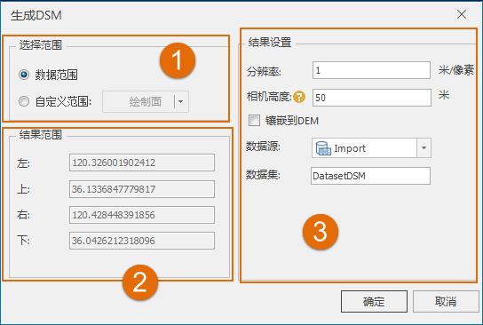
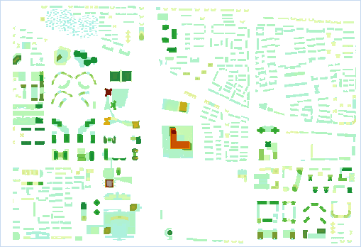

---
id: CreatDSM
title: 生成DSM数据  
---  
### 使用说明

DSM(Digital Surface Model) 即数字地表模型数据，是指包含了地表建筑物、桥梁、树木等要素的地表高程模型。与 DEM
的区别在于：DEM 只包含了地形高程信息，并未包含其它地表信息，DSM 在 DEM
的基础上，进一步涵盖了除地面以外的其它地表信息的高程，多应用于对建筑物高度有需求的领域。

“生成DSM”功能可将当前场景中的 *.scp 数据生成为 DSM 数据，即根据 *.scp 文件所索引的 OSGB 数据生成 DSM 数据。

### 操作步骤

1. 新建一个平面场景或球面场景，在图层管理器中单击“普通图层”右键，选择“添加三维切片缓存图层...”，加载需生成 DSM 的 SCP 数据。
2. 在“ **三维分析** ”选项卡的“ **模型出图** ”组中，单击“ **生成DSM** ”按钮，弹出“生成DSM”对话框。  
  

3. 在对话框中的“选择范围”处设置输出范围，输出范围有数据范围、自定义范围两种种方式，各选择方式的具体操作如下所述： 
      * **数据范围** ：单击选中“数据范围”单选框，即可将当前场景中的所有图层范围的并集设置为结果数据范围；
      * **自定义范围** ：单击选中“自定义范围”单选框，可通过选择面或绘制面方式来设置结果数据范围。 
      * 绘制面：单击右侧下拉按钮，选择“绘制面”选项，将鼠标移至当前地图窗口，绘制一个矩形作为结果数据范围即可。
      * 选择面：若当前地图窗口中有面图层，则可激活下拉选项中的“选择面”选项，在当前场景窗口中选择一个面对象后，即可将选中面对象的外接矩形范围设置为结果数据范围。
4. “结果范围”处的左上右下用于显示结果数据的范围。
5. 在对话框的“结果设置”处，可设置结果数据的保存名称、分辨率、相机高度等，具体说明如下： 
      * **数据源** ：列出了当前工作空间中所有的数据源，选择结果数据集所在的数据源。默认与源数据源相同。
      * **数据集** ：用于显示和设置结果 DSM 数据集的名称。默认数据集名称为DatasetDSM。
      * **分辨率** ：用于设置生成的 DSM 数据的分辨率。默认为1，单位为米/像素。
      * **相机高度** ：用于设置生成 DSM 数据的相机高度，相机高度越低看到的建筑物越细致，默认为50米，即表示生成的 DSM 数据为50米相机高度处看到的地表情况。
      * **附加高度** ：用于设置生成DSM 数据的附加高度，支持输入正负值作为附加高度。
      * **镶嵌到DEM** ：勾选“镶嵌到DEM”复选框，弹出“确认镶嵌”对话框，如图所示。对话框提示“镶嵌会修改原始DEM数据！”的内容，单击“ **确认** ”按钮，确认勾选，单击“ **取消** ”按钮，取消勾选。    

6. 设置完以上参数后，单击“确定”按钮，即可执行生成 DSM 数据的操作。根据示范数据中的 CBD 场景生成的三维切片缓存，生成的 DSM 数据如下图所示：               
  
### 注意事项

1. 生成DSM数据得到的结果数据集为栅格数据集。球面场景中生成的栅格数据集默认投影坐标系为GCS_WGS 1984，可以自定义。

