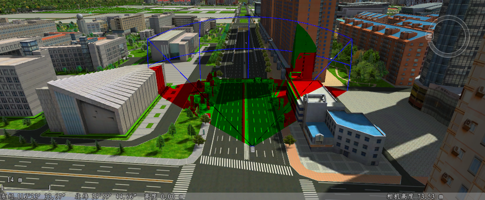

---
id: DynamicViewshed3D
title: 动态可视域分析  
---  
### 使用说明

动态可视域分析是在三维场景中，根据指定的路线，基于一定的水平视角、垂直视角及指定范围半径，分析沿路线行驶过程中的指定范围内的通视情况。可以动画形式播放演示从分析路线起点到终点的可视域分析结果，分析结果以不同的颜色来区分分析区域的可见或不可见。

动态可视域在安保监控、航空以及军事方面有重要的应用价值。

### 操作步骤

  1. 在场景中添加需进行可视域分析的数据，单击“ **三维空间分析** ”选项卡中的“动态可视域”按钮，弹出“三维空间分析”面板。
  2. 在场景中添加分析路线，添加方式有绘制、鼠标选择、导入三种，具体操作如下所示： 
      * 当鼠标状态变为激活状态，可在模型数据表面单击鼠标左键绘制分析路线，单击右键结束绘制，确定可视域分析的范围。其绘制操作方式与折线绘制一致。
      * 若当前场景中已添加三维线数据集，单击工具栏中的 选择按钮，选择一条三维线作为分析路线，单击右键结束。
      * 在“三维空间分析”面板中选中“动态可视域”结点，单击工具栏中的“导入”按钮，弹出“导入观察点”对话框，在对话框中选择三维线数据集作为路线导入，并设置相关参数。 
  3. 动态可视域分析可在“参数设置”处设置分析相关参数，包括可视距离、水平视角、垂直视角、可见区域颜色、不可见区域颜色和分析精度等，可在分析结果列表中同时选中一个或多个结果进行设置： 
      * **可视距离** ：用来设置可视域分析时的长度范围，单位为米。直接输入可视距离，可调整可视域分析范围。
      * **水平视角** ：用来设置可视域分析的水平方向的范围，默认为 90 度。
      * **垂直视角** :用来设置可视域分析垂直方向的分析范围，默认为 60 度。
      * **区域颜色** ：单击“可见区域颜色”或“不可见区域颜色”右侧下拉按钮，可重新设置可见区域和不可见区域的颜色。
      * **分析精度** ：可设置分析结果的精度等级，包括低级、中级、高级三个等级。
  4. 动态可视域的分析结果，可依据一定的速度进行播放分析路线的可视域情况。在“播放设置”处可进行相关的播放参数，包括播放总时间、速度、模型风格等。 
      * **总距离** ：用于显示分析路线的起点到终点的总长度，单位为：米。
      * **总时间** ：用于显示和设置动态可视域分析结果的播放时间，单位为：秒。
      * **速度** ：用来显示和设置从当前选中分析路线的起点到终点的播放速度，单位为：m/s，默认速度为 1.7 m/s。
      * **角色** :可设置分析路线播放所使用的模型，可选择的播放模型类型有男士、女士、汽车、飞机四种。
      * **循环播放** ：勾选该复选框后，在执行分析结果播放时，将重复执行分析路线的播放操作，直到用户停止播放；若未选中该复选框，则执行播放操作时，只能播放一次分析路线。
      * **第一人称视角** ：勾选该复选框后，将以第一人称视角播放分析结果，此时场景视角不可调整；若未勾选该复选框，在播放分析结果时可任意调整场景视角。
  5. 三维空间分析面板下方提供的播放控件，可用来控制开始、暂停或停止播放。      
  
  6. 工具条区域，提供了观察点添加、导入、导出，及删除可视域分析结果等操作。

      工具条按钮说明

      * “绘制” 按钮：可以通过鼠标绘制添加参与分析的路线，通过单击右键结束绘制。
      * “选择” 按钮：若当前场景中已添加三维线数据集，用于选择一条三维线作为分析路线，单击右键结束。
      * “删除” 按钮：用来移除面板中选中的动态可视域分析记录。
      * “导入” 按钮：用来导入三维线数据集作为分析路线，并设置相关参数，进行动态可视域分析，“导入路线”对话框内参数设置如下所示： 

        * **数据源** ：要导入的路线数据所在的数据源。

        * **数据集** ：路线数据所在的三维线数据集。

        * **名称** ：指定导入路线名称所在的字段，或在组合框中直接输入路线名称，该名称显示在动态可视域分析记录列表中。

        * **可视距离** ：指定路线进行可视域分析的可视距离值所在字段，或在组合框中直接输入距离值，单位为米。

      * “导出” 按钮：将动态可视域分析记录的路线导出为线数据集，可设置路线名称、可视距离字段信息保存到属性表中。具体参数内容如下所示： 

        * **数据源** ：要导出的分析路线数据所在的数据源。

        * **数据集** ：导出分析路线三维线数据集的保存名称。

        * **名称** ：勾选“名称”复选框可导出分析路线的名称，并设置保存字段名称。

        * **可视距离** ：勾选“可视距离”复选框可导出可视距离信息，并设置保存字段名称。

  
  

