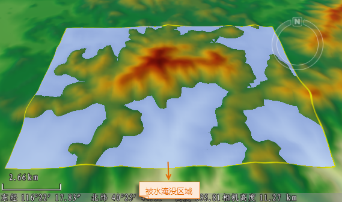

---
id: Flood3D
title: 淹没分析  
---  
### 使用说明

淹没分析是指根据指定的最大、最小高程值及淹没速度，动态模拟某区域水位由最小高程涨到最大高程的淹没过程。该功能应用于地形、DEM等数据。

### 应用场景

该功能应用场景有：

* 根据某区域洪水涨势速度，模拟洪水涨到指定高程的淹没过程，为防洪救灾提供一定的参考。
* 淹没分析结果可为河流区域的水利工程或建筑地选址提供依据。

### 操作步骤

1. 在场景中添加需进行淹没分析的数据，单击“ **三维分析** ”选项卡上的“ **空间分析** ”组中的“淹没分析”按钮，弹出“三维空间分析”面板。
2. “三维空间分析属性”工具栏中，提供了"绘制"、"选择"、"移除"、"导入"、 "导出"等工具。
工具条按钮说明：
    * "绘制" 按钮：用来绘制参与淹没分析的多边形区域。
    * "选择"按钮：用于在场景中选择一个三维面作为分析区域。
    * "移除" 按钮：用来移除分析结果列表中 选中的分析记录。
    * "导入" 按钮：用于导入参与分析的三维面数据集。可设置导入数据集的名称、最小可见高度以及最大可见高度的字段。
    * "导出" 按钮：用于导出分析区域。可勾选名称、最小可见高度、最大可见高度等复选框进行设置。
3. 淹没分析可在“三维空间分析”面板处设置分析相关的参数，包括分析结果纹理颜色、透明度、播放设置等参数。可在分析结果列表中同时选中一个或多个结果进行设置： 
    * **参数设置** ：
    * **纹理颜色表** ：用来设置分析区域的填充纹理颜色，对应区域的高程值不同，则显示的颜色不同。
    * **透明度** ：用来设置分析区域填充纹理及等值线的透明度，默认值为 0。
    * **播放设置:**
    * **当前高程** :用来显示和设置当前水位所到达的高程值，当前高程需在最小高程和最大高程范围内。
    * **最小可见高程** ：用于设置淹没分析的最小高程。
    * **最大可见高程** ：用于设置淹没分析的最大高程。
    * **总时间** ：用于显示和设置动态模拟淹没分析结果的播放时间，单位为：秒。
    * **速度** ：用来显示和设置从当前选中淹没分析结果由最小高程淹没至最大高程的动态播放速度，单位为：m/s。
    * **循环播放** ：勾选该复选框后，在执行分析结果播放时，将重复执行淹没效果的播放操作，直到用户停止播放；若未选中该复选框，则执行播放操作时，只能播放一次淹没效果。
4. 三维空间分析面板下方提供的播放控件，可用来控制开始、暂停或停止播放。淹没分析的播放效果如下图所示：       
  
 
  
### 注意事项

1. 该淹没分析功能适用于栅格地形。
2. 倾斜摄影模型和TIN地形数据的淹没分析功能是通过数据对应的图层属性面板实现的。详情请参见[淹没效果](../AdvancedLayserSetting/Layer3DProperty_Flooding)。

