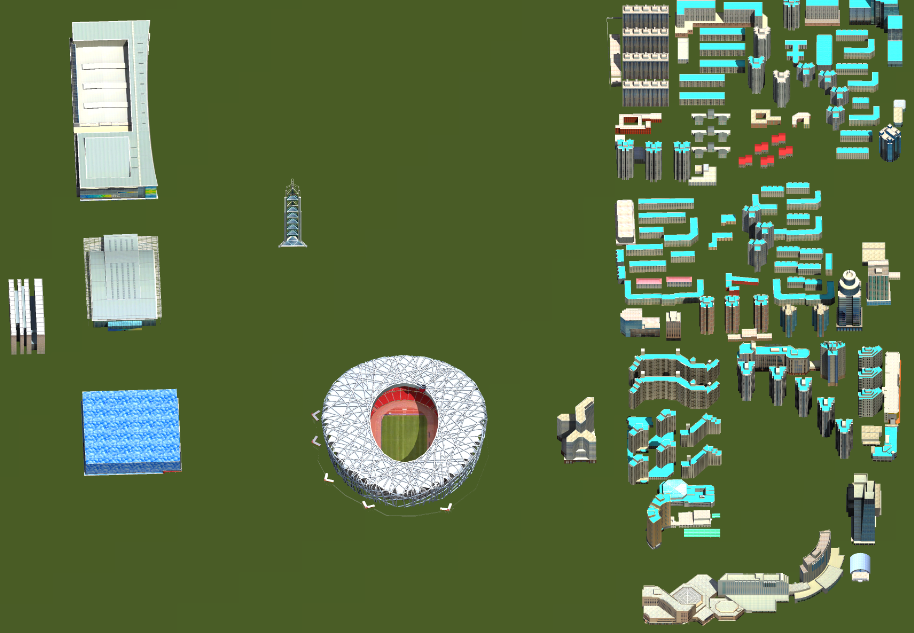

---
id: Generate25DMap
title: 生成2.5维  
---  
### 使用说明

2.5维电子地图即三维电子地图或2.5D电子地图，是依据三维电子地图数据库为基础，按照一定比例对现实世界或其中一部分的一个或多个方面的三维、抽象的描述。“生成2.5维”功能是将三维场景输出成2.5D地图，直观展示地理场景。2.5D地图目前已经成为互联网业务发展的新亮点。

### 操作步骤

1. 加载包含三维场景的数据源，把三维场景添加到新球面场景。
2. 在“ **三维分析** ”选项卡上的“ **模型出图** ”组中，单击“ **生成2.5维** ” 按钮，弹出“生成2.5维”对话框. 
3. 在对话框中的“选择范围”处设置模型输出范围，模型输出范围有数据范围、自定义范围两种方式，各选择方式的具体操作如下所述： 
      * **数据范围** ：单击选中“数据范围”单选框，即可将当前场景中的所有图层范围的模型集合设置为结果数据范围。默认是选择“数据范围”。
      * **自定义范围** ：单击选中“自定义范围”单选框，可通过选择面或绘制面方式来设置结果数据范围。 
      * **绘制面** ：单击右侧下拉按钮，选择“绘制面”选项，将鼠标移至当前地图窗口，可以绘制任意多边形作为结果数据范围。
4. “结果范围”处的左上右下用于显示结果数据的范围。
5. 在对话框的“结果设置”处，可设置结果数据的分辨率、基准高度、最大高度、方位角、俯仰角、文件名称和是否勾选生成2.5维矢量面。
6. 设置完以上参数后，单击“确定“按钮，即可执行生成2.5维地图的操作，同步生成对应的矢量面数据。示范结果如下图所示：            

  
### 注意事项

1. 生成2.5维影像的俯仰角支持在0-180度之间。
2. 多个模型图层生成多个2.5维矢量图。

