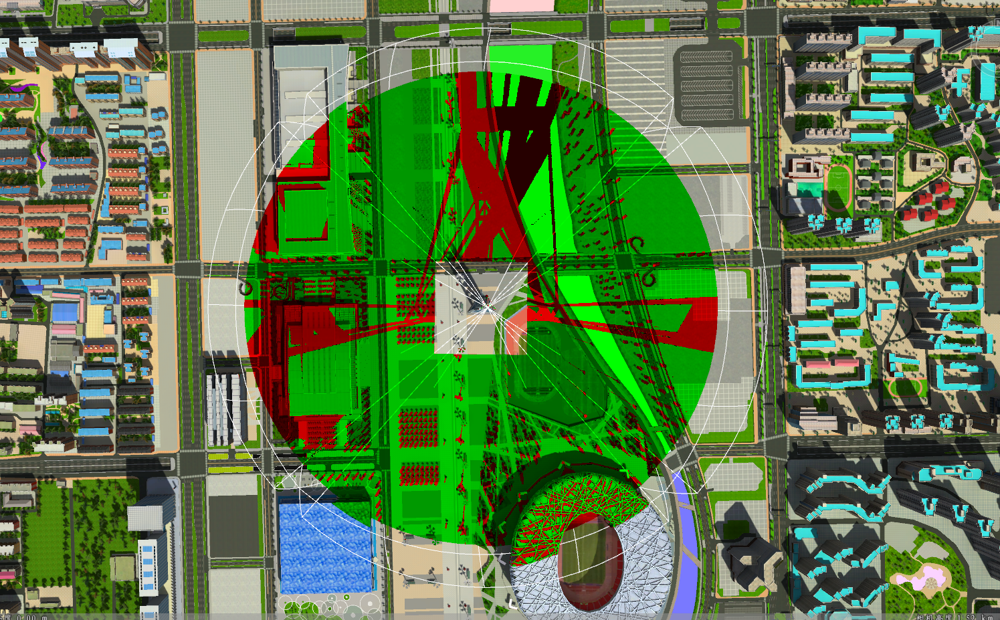

---
id: MultiViewShed3D
title: 多重可视域分析  
---  
### 使用说明

三维多重可视域分析是在场景的模型数据表面，相对于某个观察点，基于一定的水平视角、垂直视角及指定范围半径，绘制多个区域，分析所有区域内所有通视点的集合。分析结果用绿色区域表示在观察点处可见，红色区域表示在观察点处不可见。

### 应用场景

多重可视域可被广泛应用于安保、监控、深林防火观察台设置、航海导航、航空以及军事等多方面。

### 操作步骤

1. 在场景中添加需进行多重可视域分析的数据。 
2. 在" **三维分析** "选项卡上的“ **空间分析** ”组，单击“多重可视域”按钮，弹出“三维空间分析”面板。
3. 当鼠标状态变为激活状态，即可在模型数据表面单击鼠标选取观察点，并移动鼠标设置可视域距离，可多次选重复此操作，从而确定多重可视域分析的范围。 
4. 确定多重可视域分析的观察点和可视距离之后，可在“三维空间分析”工具条中，继续添加多重可视域分析，支持增加、删除、导入、导出、保存分析结果以及障碍点和视线等操作。 
5. 三维多重可视域分析可设置观察者信息，包括位置、附加高度、方向角、俯仰角和可视距离，可在分析结果列表中同时选中一个或多个结果进行设置： 
    * **观察位置** ：分别在 X、Y、Z 文本框中输入观察点的坐标值，可修改观察点的位置。 
    * **附加高度** ：附加高度可近似看为人的身高，在附加高度文本框中附加高度值，可修改观察点的位置。默认为1.8米。 
    * **方向角** ：当前相机的方向与正北方向的夹角。可直接输入方向角角度，方位角支持任意角度值。 
    * **俯仰角** ：即当前分析的相机方向与地平面的角度。可直接输入俯仰角角度，调整多重可视域分析的俯仰角。 
    * **可视距离** ：用来设置多重可视域分析时的长度范围，单位为米。直接输入可视距离，可调整多重可视域分析范围。
6. 在参数设置区域可设置分析结果的相关参数，包括水平视角、垂直视角、可见区域颜色、不可见区域颜色和分析精度： 
    * **水平视角** ：用来设置多重可视域分析的水平方向的范围。 
    * **垂直视角** :用来设置多重可视域分析垂直方向的分析范围。 
    * **区域颜色** ：单击“可见区域颜色”或“不可见区域颜色”右侧下拉按钮，可重新设置可见区域和不可见区域的颜色。 
    * **提示线颜色** ：单击“提示线颜色”右侧下拉按钮，可重新设置提示线的颜色和透明度。提示线即可视域范围。
    * **分析精度** ：可设置分析结果的质量等级，包括低级、中级、高级三个等级。 
    * **视口** ：用于显示多重可视域分析在第一视口进行，视口不可更改。
7. 工具条区域，提供了观察点添加、删除、导入、导出和保存分析结果、保存障碍点和障碍线等操作。工具条按钮说明：

    * “添加” 按钮：可以通过鼠标单击确定观测点位置，并移动鼠标再次单击确定多重可视域分析区域半径。
    * “删除” 按钮，用来移除面板中选中的多重可视域分析记录。 
    * “导入”按钮：用来导入三维点数据集作为观察点，并设置相关参数，进行多重可视域分析。“导入观察点”对话框内的参数如下： 

        * **数据源** ：要导入的观察点数据所在的数据源。

        * **数据集** ：观察点数据所在的数据集。

        * **方向角** ：选择方向角所在字段，或直接输入方向角角度值，角度范围为：-180至180度。

        * **俯仰角** ：选择俯仰角所在字段，或直接输入俯仰角角度值，角度范围为：-90至90度。

        * **可视距离** ：选择可视距离所在字段，或直接输入距离值，单位为米。

    * “导出”按钮：将多重可视域分析记录的观察点导出为点数据集，可设置方向角、俯仰角、可视距离字段信息保存到属性表中。 具体参数如下所示：

        * **数据源** ：要导出的观察点数据所在的数据源。

        * **数据集** ：导出观察点数据集的保存名称。

        * **方向角** ：勾选“方向角”导出其角度信息，并设置保存字段名称。

        * **俯仰角** ：勾选“俯仰角”导出其角度信息，并设置保存字段名称。

        * **可视距离** ：勾选“可视距离”导出可视距离信息，并设置保存字段名称。

    * “保存障碍点”按钮：保存障碍点和视线。 具体参数如下所示：

        * **数据源** ：分析结果保存的目标数据源。

        * **点数据集名** ：分析结果保存的障碍点数据集的名称，可自定义。

        * **线数据集名** ：分析结果保存的视线数据集的名称，可自定义。

8. 多重可视域分析效果图如下，其中红色范围为不可视区域，绿色范围为可视区域。       

9. 勾选“三维空间分析”面板上的“高亮显示可见体”，场景中会高亮显示可见模型，同时自动关联打开属性表，显示可见模型的属性信息。 

### 注意事项

1. 多重可视域的观察点个数建议在七个以内。

