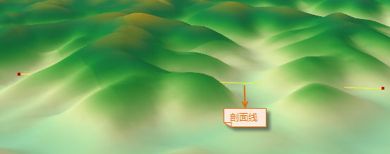
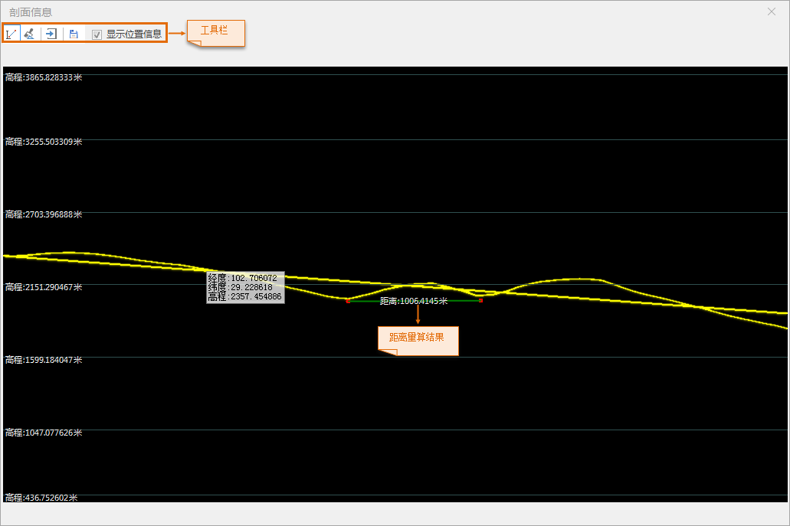

**使用说明**

剖面分析是指根据指定的剖面线，输出剖面线与地形数据的表面高程沿某条线（截面）的变化，或剖面线所截的模型建筑物、地下管线等的轮廓线。并支持在剖面线图上进行量算和位置查询功能，支持将剖面图输出为图片数据保存，支持导出点数据集和高亮显示与剖面线相交的模型。该功能适用于地形数据和模型数据。

**应用场景**

剖面分析广泛应用于工程选线、设施选址、管线布设、煤矿开采、土地利用规划等方面，例如：

  * 通过剖面分析功能输出地下管线剖面图，通过距离量算功能量算管线直径。
  * 剖面分析可应用于评估道路修建的难度，或对沿指定路径铺设铁路线的可行性进行评估。

**操作步骤**

  1. 在场景中添加需进行剖面分析的地形数据或模型数据，在“ **三维分析** ”选项卡上的“ **空间分析** ”组中，单击 按钮，弹出“三维空间分析”面板。
  2. 单击添加按钮，将鼠标移至场景中，可在任意绘制一条直线作为剖面线。单击鼠标左键开始绘制，再次单击鼠标即可结束绘制，确定一条剖面线，并弹出“剖面信息”对话框。  
  

  3. “剖面信息”对话框的工具条处提供了距离量算、导出为图片、保存点数据集、显示位置信息等功能，具体操作说明如下： 
       * **量算** ：单击工具栏中的“量算”按钮，将鼠标移至剖面信息图中，单击鼠标左键，确定量算的起点，移动鼠标，再次单击鼠标左键确定量算路径的终点，此时，窗口中会显示量算路径的距离值。
       * **清除** ：单击工具条中的“清除”按钮，即可清除当前窗口中长度量算的数值注记。
       * **导出为图片** ：单击“导出为图片”按钮，在弹出的“导出图片”对话框中，设置图片保存的路径、名称，及图片保存类型即可。图片输出的类型，可以是 JPG 文件、PNG 文件、位图文件、EMF 文件、GIF 文件、EPS 文件以及 TIFF 影像数据。
       * **保存点数据集** ：单击“保存Profile_1分析结果”按钮，在弹出的“保存Profile_1分析结果”对话框中，设置点数据集保存的数据源、数据集、图形字段名、模型ID字段名。
       * **显示位置信息** ：勾选该复选框后，将鼠标移至窗口中的剖面信息处，可显示鼠标所在剖面线的位置信息和高程值；若不勾选该复选框，则不显示位置和高程信息。  
  

  4. 对于模型数据集，勾选“ **高亮显示障碍物** ”复选框，场景中会高亮显示与剖面线相交的模型，同时自动关联打开属性表，显示相交模型的属性信息。
