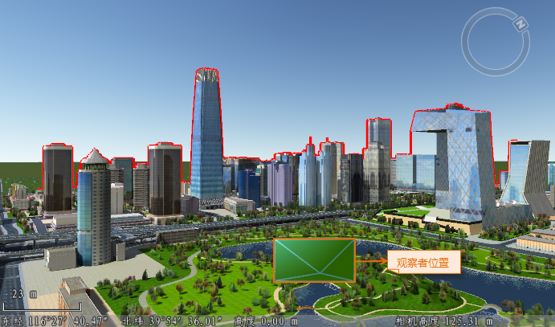
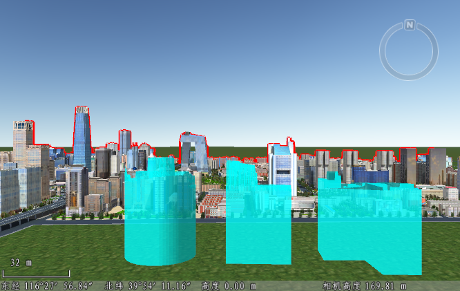

**使用说明**

天际线是指天空与观察点周围的表面以及要素相分离的界线。天际线分析功能可根据观察点，生成当前场景窗口中建筑物顶端边缘与天空的分离线。借助分离线可以直观发现不和谐的建筑体。

**应用场景**

可实际应用于城市规划设计中的建筑物限高分析、分析建筑物对天际线的影响等。

**操作步骤**

  1. 在“ **三维分析** ”选项卡上“ **空间分析** ”组，单击“ **天际线分析** ” 按钮，或在已打开的“三维空间分析”面板中，选中“天际线分析”结点。
  2. 确定天际线分析观察点有一下几种方式： 
       * **第一人称相机** ：选择“第一人称相机”单选框，在场景中通过鼠标操作，通过缩放或平移，调整当前场景的视图，以当前场景视图角度和范围进行天际线分析。
       * **自定义三维点** ：选择“自定义三维点”单选框，单击“拾取”按钮，在场景中拾取观一个点作为提取天际线的观察点。
       * **输入观察位置** ：在以上两种观察模式下，都可在“观察位置”的 X、Y、Z 文本框中，直接输入观察点位置，及观察位置的水平方向和俯仰角，修改观察点位置。 
         * **方位角** ：观察点相机的方向与正北方向的夹角。可直接输入水平方向角度值，调整天际线分析的方向角，角度范围为：0° 至 360°。
         * **俯仰角** ：观察点相机方向与地平面的角度，可直接输入俯仰角角度值，调整天际线分析的俯仰角，角度范围为：-90°至 90°。
         * **半径** ：观察点视线范围，可直接输入半径值，调整天际线分析的范围，默认为无穷大。
  3. 确定观察点位置后，单击工具条中的“分析” 按钮，即可进行天际线分析，在当前场景窗口中得到一条天际线。  
  
  
  4. 在“三维空间分析”面板的“参数设置”处，修改天际线的颜色和质量。 
       * **天际线颜色** ：单击天际线颜色右侧下拉按钮，选择线颜色，默认为红色；
       * **天际线质量** ：单击天际线质量右侧下拉按钮，选择天际线显示质量，可设置线质量为高级、中级或低级，其中，设置为高级时线质量最好，默认天际线质量为中级。
       * **显示观察者位置** ：该复选框用于控制是否显示观察者位置，若勾选该复选框，分析天际线之后将当前场景往离观察点较远的方向平移，即可看到观察者位置；不勾选则不显示观察者位置。
       * **360度分析** ：该复选框用于控制是否进行360度天际线分析，若勾选该复选框，以观察点为圆心进行360度分析；不勾选则不进行360度分析。
       * **高亮显示障碍物** ：该复选框用于控制是否进行高亮显示影响天际线的模型，若勾选该复选框，场景中会高亮显示影响天际线的模型，同时自动关联打开属性表，显示影响天际线模型的属性信息。
  5. 工具条区域，提供了天际线分析结果的添删除及导出等操作，同时支持天际线定位功能。 
       *  按钮，用来移除当前场景中的天际线分析结果。
       *  按钮：可将天际线分析结果导出为二维线数据集、三维线数据集、扇形面数据集、拉伸闭合体数据集，可设置数据集保存名称。当导出为扇形面数据集时，可设置扇形面半径。当导出为拉伸闭合体数据集时，可设置半径和拉伸高度。
       * 定位：双击“天际线分析”结点，或者单击其右键，选择“定位到”，即可定位当前场景天际线分析结果。
  6. 天际线分析还可应用于城市规划中，为了不破坏城市的天际线，可通过城市规划需新建的建筑物的三维面数据，及某固定视角的天际线，分析得到三维面对象相应的限高体。具体操作如下：  
限高体分析

     1）. 确定观察点提取天际线后，单击“城市建筑规划”展开“建筑模型管理”参数面板。  
     2）. 单击工具栏中的“添加建筑平面” 按钮，添加方式有以下三种： 
       * 选择三维面对象：将三维面数据添加到当前场景窗口中，并选择要进行建筑模型最高限体分析的面对象。
       * 选择三维面图层：将三维面数据添加到当前场景窗口中，并在图层管理器中选择需进行建筑模型最高限体分析的面图层。
       * 选择三维面数据集：在弹出的选择对话框中，选择三维面数据集进行建筑模型最高限体分析。
  
     3）. 添加了三维面数据后，即可根据当前的天际线执行限高体分析操作，得到面对象的最高建筑模型。可重新调整第一人称相机，或重新指定观察点，进行天际线和限高体分析。  
  

      4）. 建筑模型管理面板的工具栏处，提供了限高体选择、删除、导出等功能： 
        * 全选：单击“全选” 按钮，用来选中列表框中的所有限高体记录。
        * 反选：单击“反选” 按钮，用来反向选择列表框中的记录，即原来没有被选择的记录变为选中状态；原来选中的记录变为非选中状态。
        * 移除：单击“移除”按钮，用来移除列表框中选中的一条或多条记录，同时移除场景中对应的限高体。
        * 导出：单击“导出” 按钮，弹出“导出限高体”对话框，设置导出数据集保存在的数据源和保存名称，单击“确定”按钮，即可将限高体导出为 CAD 模型数据集。
        * 定位：在建筑模型列表中，双击某一条建筑模型列表，即可定位到该建筑模型所在位置。

**注意事项**

  1. 在球面场景中导出的限高体数据集坐标系为地理坐标系： WGS 1984；在平面场景中导出的限高体数据集坐标系为平面坐标系：米。
