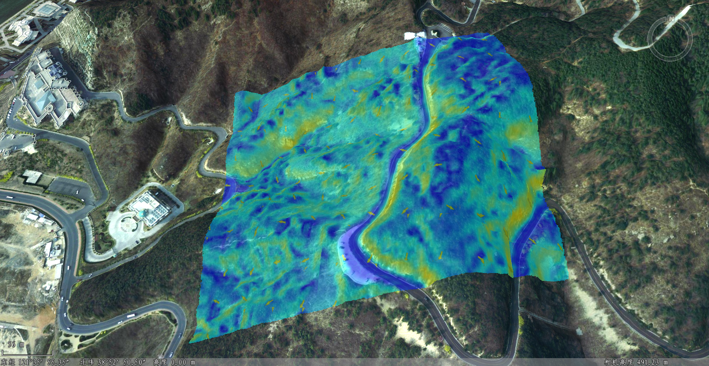

**使用说明**

坡度和坡向是两个重要的地形特征因子，在地形表面分析中起到重要作用。其中，坡度是地表面上某一点的切面和水平面所成的夹角，坡度值越大，地势越陡峭；坡度值越小，地势越平坦。而坡度变化的方向称为坡向，指每个像元到其相邻像元方向上值的变化率最大的下坡方向，表示地表面某一位置斜坡方向变化的量度。

三维坡度坡向分析用于计算栅格数据集中各像元的坡度值，及像元坡度面的朝向。坡度用度数表示的分析结果的范围是0到90°；坡向计算的范围是0到360°，以正北方0°为开始，按顺时针移动，回到正北方以360°结束。

**操作步骤**

  1. 以地形数据方式添加栅格数据到场景中，在“ **三维分析** ”选项卡上的“ **空间分析** ”组中，单击 按钮。
  2. 单击添加按钮，将鼠标移至场景中，当鼠标状态变为 ，即可在数据表面单击鼠标确定多边形起始位置，移动鼠标即可看到矩形范围内的坡度坡向预览效果，并再次单击鼠标左键，确定分析区域的矩形范围，即可得到分析结果。分析结果以不同颜色表示坡度值，箭头方向表示坡向信息。在坡度坡向分析面板左下方勾选“流动”，分析区域内的箭头有流动效果。
  3. 在坡度坡向分析记录列表中选中某条记录，单击“鼠标查看坡度坡向信息”右侧按钮，将鼠标移至选中分析记录的对应区域中，可查询某点处的具体坡度、坡向值。  
  

  4. 确定坡度坡向分析区域之后，可在“三维空间分析属性”工具栏中，继续添加坡度坡向分析范围，或删除分析结果。  
工具条按钮说明

     *  按钮：用来绘制参与坡度坡向分析的矩形区域。
     * 按钮：用于在场景中选择一个三维面作为分析区域。
     *  按钮：用来移除分析结果列表中选中的分析记录。
     *  按钮：用于导入参与分析的三维面数据集。
     *  按钮：用于导出分析区域。

  5. 坡度坡向分析结果可设置显示模式、透明度、颜色表等相关参数，可在分析结果列表中同时选中一个或多个结果进行设置： 
       * 显示模式：用来设置提取结果的显示模式，可设置的显示模式有坡度、坡向、坡度与坡向三种。
       * 透明度：用来设置分析区域填充纹理的透明度，默认值为 0。
       * 颜色表：同来设置分析区域的填充颜色，对应区域的坡度不同，则显示的颜色不同。

**注意事项**

  1. 只支持带法线的TIN地形。
