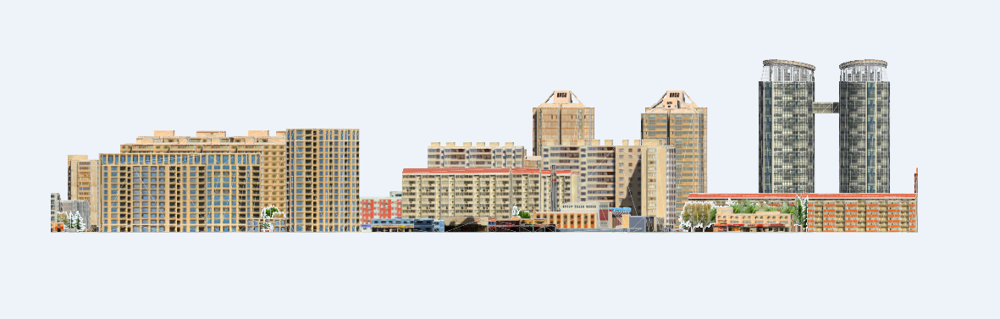

**使用说明**

立面图反映了建筑的外貌和立面装修的效果。在三维建筑场景中，借助生成的立面图来直观地评价建筑群的美观性，并且方便地获得影响立面图美观的建筑物。

“生成立面图”功能支持生成对应的矢量面数据，为建筑规划等行业带来了便利，提供决策支持。

**操作步骤**

  1. 加载包含三维场景的数据源，把三维场景添加到新球面场景。
  2. 在“ **三维分析** ”选项卡上的“ **模型出图** ”组中，单击“ **生成立面图** ” 按钮，弹出“生成立面图”面板。
  3. 在工具栏中，单击“绘制线”按钮，鼠标变为“+”号。在场景中绘制一条线，绘制方向的左侧即为要生成的立面图的建筑物。
  4. 设置分辨率、底部高程、最大高度、最远距离、文件名称、是否生成2.5维矢量面这6个参数值：
       * 分辨率：默认为0.5，单位为米/像素，可通过分辨率右侧的上下箭头进行调整数值，支持直接输入数值，数值越小，分辨率越高。
       * 底部高程：默认为0，单位为米，表示从地平面开始向上进行立面图出图。可通过底部高程右侧的上下箭头进行调整数值，支持直接输入数值。
       * 最大高度：默认为100，单位为米，表示从底部高程向上100米为出图的高度范围。可通过最大高度右侧的上下箭头进行调整数值，支持直接输入数值。
       * 最远距离：默认为500，单位为米，表示离绘制线的最远距离，确定了出图的距离范围。可通过最远距离右侧的上下箭头进行调整数值，支持直接输入数值。
       * 文件名称：默认存储在C盘，出图格式为tiff。直接输入出图路径或单击右侧“文件浏览”按钮选择路径。
       * 当勾选“生成2.5维矢量面”，确定矢量面存储的数据集和数据集所在的数据源。
  5. 单击“确定”按钮，单击“确定”按钮，进行立面图生成。示范数据生成结果如下：   
  
