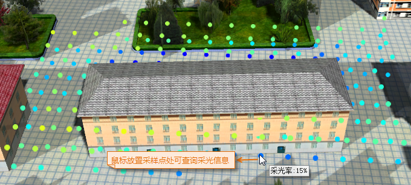

**使用说明**

日照分析是指根据指定的区域所在的经纬度范围，计算该区域在某段时间内，可被太阳照射到的时间长度。同时根据指定的最大、最小高度、采样距离、采样频率，得到指定区域内的采光信息，采光值表示该处日照时间占开始时间到结束时间中时间的百分比。

该日照分析是基于GPU分析日照，相较于基于数据的“[日照分析](../3DDesigner/3DAnalysis/ModelSunshineAnalyst.html)”，精度较低。

**分析原理**

地理位置是决定太阳光照空间变化的一个重要因素，不同经纬度、模型要素投射的阴影等方面因素会影响某区域接收到的日照时间长短。日照分析考虑到太阳角度的日变化和季节性变化以及周围地形投射的阴影所带来的影响，得出指定范围内的采光信息，即日照时间所占总分析时间的百分比。

**应用场景**

该功能广泛应用于土木工程、城市规划和景观分析等领域,例如：

  * 在城市规划中，进行选址时，日照分析功能可以输出适宜性模型作为重要参考。

**操作步骤**

  1. 在“ **三维分析** ”选项卡上的“ **空间分析** ”组，单击按钮，弹出“三维空间分析”面板。
  2. 在场景中添加日照分析区域有三种添加方式：绘制面、鼠标选择三维面、导入三维面，具体操作方式如下： 
       * 单击工具栏中的  按钮，将鼠标移至场景中，在模型数据面单击鼠标左键绘制分析范围，单击右键结束绘制，确定日照分析的范围。其绘制操作方式与多边形绘制方式一致。
       * 若当前场景中已添加三维面数据集，单击工具栏中的  按钮，选择三维面作为分析区域，单击右键结束。
       * 在“三维空间分析”面板中选中“日照分析”结点，单击工具栏中的 按钮，弹出“导入分析区域”对话框，在对话框中选择三维面数据集作为分析区域导入，并设置对话框中的数据源、数据集、名称、最小/大高度以及采样距离等相关参数。
  3. 在分析记录列表中选中一条或多条分析记录，可在三维空间分析面板中进行参数设置和属性设置。 
       * **参数设置** 提供的相关参数设置有：采光率颜色表、最大、最小高度设置、采样距离等参数设置：
         * **采光率颜色表** ：用于设置分析区域采光率的显示颜色，采光率不同，则显示的颜色不同。
         * **最小高度** ：表示分析区域底部高程相对于绘制面中心点的高度，单位为米，若设置为1，则表示分析区域的底部高程为绘制面中心点的高程+1米。
         * **最大高度** ：默认为20米。表示分析区域顶部高程与绘制面中心点的相对高度，单位为米，若设置为10，则表示分析区域的顶部高程为绘制面中心点的高程+10米。
         * **采样距离** ：指在指定的平面和高度范围内，输出采样点的频率。单位为米，默认采样距离为 5 米，即在指定的分析范围和高度内，每5米的距离输出一个采光率的采样点。
       * **时间设置** 提供的相关参数设置有：开始时间、结束时间、采样频率等参数设置：
         * **开始时间** ：用于设置日照分析的开始时间，可依照给定时间格式，分别输入年、月、日、时、分、秒的具体时间，或通过鼠标单击，在文本框中选中年、月、日、时、分、秒中的某个时间，通过文本框右侧按钮进行调整，确定日照分析的开始时间。
         * **结束时间** ：用于设置日照分析的结束时间，可依照给定时间格式，分别输入年、月、日、时、分、秒的具体时间，或通过鼠标单击，在文本框中选中年、月、日、时、分、秒中的某个时间，通过文本框右侧按钮进行调整，确定日照分析的结束时间。
         * **采样频率** ：指在指定的开始和结束时间范围内，按照采样频率采集各个采样点的日照数据，单位为分钟，默认采样频率为 5 分钟，即在指定的分析时间范围内，每 5 分钟统计一次各个采样点是否有太阳日照，最后计算得出各采样点的采光率。
  4. 根据设置的参数可得到指定范围内的采光率结果，如下图所示：  
  

  5. 工具条区域提供了分析记录的删除操作，在面板中选中的一个或多个日照分析记录，单击 按钮，即可移除选中记录。
  6. 日照分析支持导出分析区域的功能，可将分析区域导出为三维面数据。单击工具条中的 按钮，在弹出的“导出分析区域”对话框中，设置导出三维面数据保存名称和所在的数据源，及导出后数据集中需要保留的名称、最小高度、最大高度、采样距离等信息。
  7. 日照分析支持分析结果导出功能，可将分析结果导出为三维点数据。单击工具条中的 按钮，在弹出的“保存分析结果”对话框中，设置导出三维点数据保存名称和所在的数据源，强度字段等信息。
