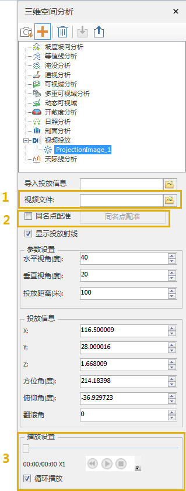
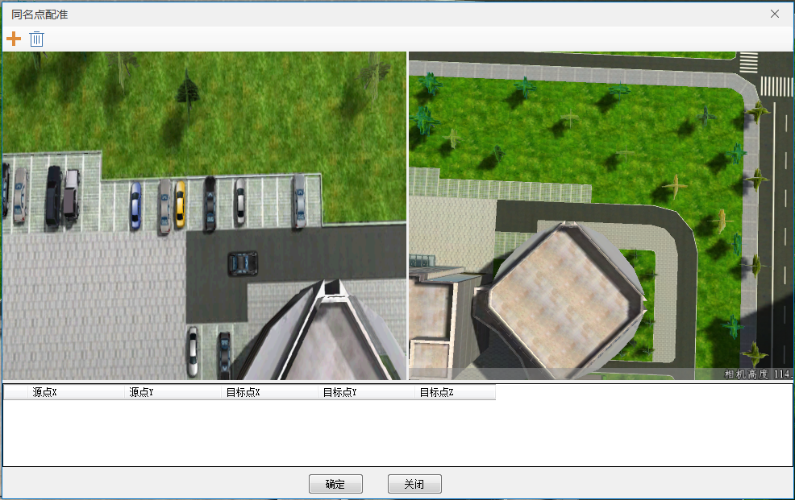
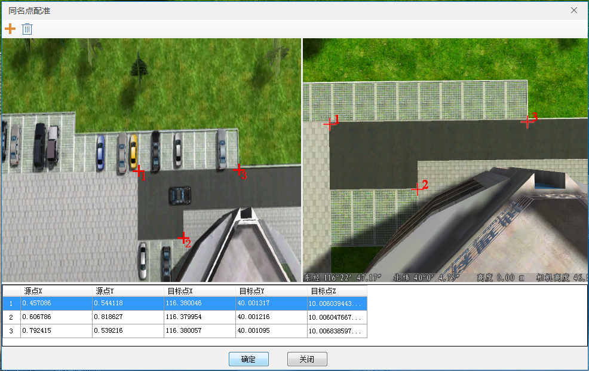

---
id: VideoPlay
title: 视频投放  
---  
### 使用说明

三维场景下，将当前视角作为观察点或者指定观察点，将指定的AVI视频文件投影在场景中播放，用来模拟视频中事件发生的真实情景。

### 操作步骤

1. 打开AVI视频文件所记录的周边环境，定位到视频文件所记录的位置。单击“ **三维分析** ”选项卡中“ **空间分析** ”组内的“视频投放”按钮，弹出“三维空间分析”面板。       
  
2. 在视频投放面板的1号矩形框处，选择视频文件(*.avi)。
3. 在视频投放面板的2号矩形框处，勾选并进行同名点配准。弹出如下对话框：
   
4. 单击同名点配准中的添加按钮，在左边场景中添加源点，在右边场景中添加目标点。如下所示：   
   
5. 参数设置 
      * 水平视角(度)：设置视频投放水平视角大小，可用于控制投屏的长度。
      * 垂直视角(度)：设置视频投放垂直视角大小，可用于控制投屏的宽度。
      * 投放距离(米)：设置视频投放的投放距离。
6. 投放信息 
      * 坐标点：视频投放的观察点坐标。
      * 方位角(度)：视频投放的观察点方向角。
      * 俯仰角(度)：视频投放的观察点俯仰角。
      * 翻滚角(度)：视频投放的观察点翻滚角。
7. 完成同名点配准后，不显示投放射线，参数信息与投放信息不可更改。此时在图：三维空间分析-视频投放面板的3号矩形框处，对视频进行设置并播放。

### 注意事项

1. 可通过单机“导出”按钮，将视频投放信息存储为一个xml文件导出，web端可以通过此文件实现视频投放功能。

