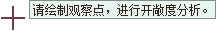
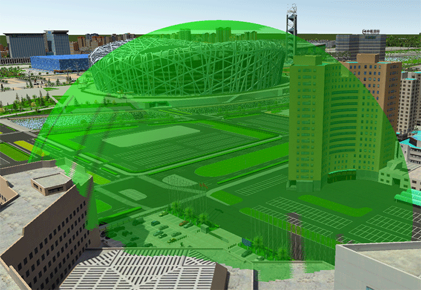
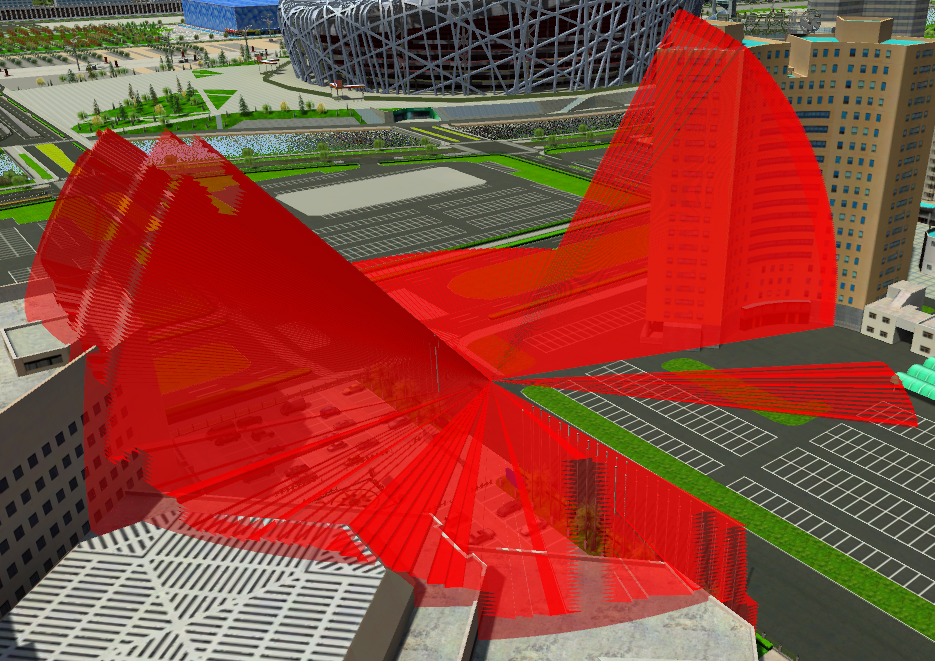

**使用说明**

三维开敞度分析是在场景中，相对于指定的观测点，基于一定的观测半径，构造出一个“视域半球体”，分析该区域内开敞度情况，模拟特点观测点周围空间的视域范围。

**应用场景**

开敞度分析功能可被用于针对城市公园，城市广场，城市步行街，城市滨水区域等居民生活相关活动场地进行空间分析，还可以衡量楼间距、楼密度，在当前位置判断能看到的天空比例等，直观地展现与分析空间的开敞程度，评估设计方案对日常生活的影响。

**操作步骤**

1. 在场景中添加需进行开敞度分析的数据。
2. 在“ **三维分析** ”选项卡上的“ **空间分析** ”组，单击按钮，弹出“ **三维空间分析** ”面板。
3. 单击添加按钮，将鼠标移至场景中，当鼠标状态变为，即可在数据表面单击鼠标选择观察点，从而进行开敞度分析。
4. 三维开敞度分析可设置观察者信息，设置观察位置： 
     * **观察位置** ：分别在 X、Y、Z 数字输入框中修改观察点的坐标值，可修改观察点的位置。
5. 在参数设置区域可设置分析结果的相关参数，包括观察半径、填充颜色、显示模式、线框颜色和分析精度，并可以选择观察开敞度的可视部分和不可视部分： 
     * **观察半径** ：用来设置开敞度分析的视域半球体的半径，默认为100米。
     * **填充颜色** :用来设置开敞度分析的视域半球体表面的填充颜色。
     * **显示模式** ：可以选择填充模式，线框加填充模式和线框模式三种模式，修改视域半球体的显示模式
     * **线框颜色** ：可设置开敞度分析的视域半球体表面线框的颜色。
     * **分析精度** ：可设置分析结果的质量等级，包括低级、中级、高级三个等级。
     * **显示可视或不可视区域** ：可设置显示分析结果为视域半球体的可视或不可视部分。
6. 面板工具条区域，提供了观察点添加、删除、导入、导出和保存分析结果操作。  
工具条按钮说明

     *  按钮：可以通过鼠标单击确定观测点位置。
     *  按钮，用来移除面板中选中的开敞度分析记录。
     *  按钮：用来导入三维点数据集作为观察点，并设置相关参数，进行开敞度分析，“导入观察点”对话框参数设置如下所示： 

        - **数据源** ：要导入的观察点数据所在的数据源。
        - **数据集** ：观察点数据所在的数据集。
        - **名称** ：观察点导入分析的名称。
        - **观察半径** ：选择观察半径所在字段，或直接输入距离值，单位为米。

      *  按钮：将开敞度分析记录的观察点导出为点数据集，可设置观察者位置、观察半径保存到属性表中。具体参数如下所示： 

        - **数据源** ：要导出的观察点数据所在的数据源。
        - **数据集** ：导出观察点数据集的保存名称。
        - **X、Y、Z** ：观察点的观察位置。
        - **观察半径** ：勾选“观察半径”导出其观察半径，并保存到字段中。

     *  按钮：保存开敞度分析结果。 

        - **数据源** ：分析结果保存的目标数据源。
        - **数据集** ：分析结果保存的目标数据集的名称，可自定义。
        - **输出模型类别** ：可选择开敞度表面或开敞度体，输出开敞度的视域半球体的表面或体。
        - **开敞度可视性** ：可选择开敞度的可视性，输出开敞度的可视部分或者不可视部分。

     *  按钮：保存开敞度分析的视线和障碍点。 

        - **数据源** ：分析结果保存的目标数据源。
        - **点数据集名** ：分析结果保存的障碍点数据集的名称，可自定义。
        - **线数据集名** ：分析结果保存的视线数据集的名称，可自定义。

7. 开敞度效果图如下。  
  

  1. 开敞度保存结果如下：  
        

