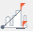
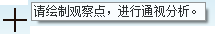
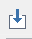
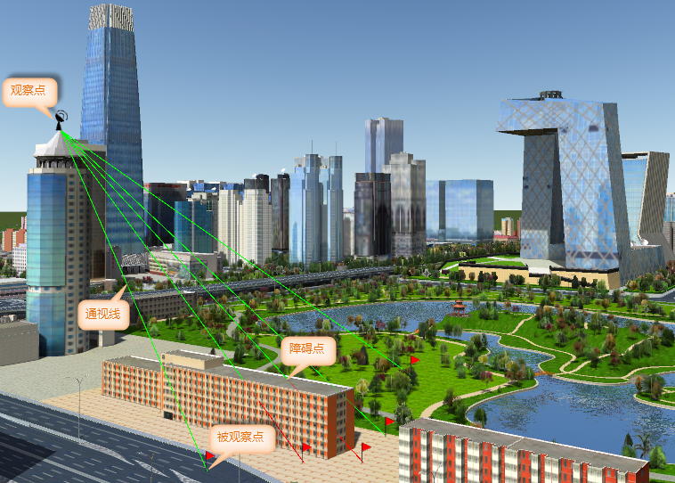

**使用说明**

通视分析是三维GIS中常用的分析功能，用于判断三维场景中任意两点之间的通视情况。可根据在 3D
空间中相对于某表面或多面体要素类提供的障碍的位置，计算观察点与被观察点之间的通视性，沿着这些点之间的视线确定可见性。

通视分析需要用户指定观察点和被观察点，观察点与被观察点是一对多的关系，一个观察点可对应多个被观察点进行分析，一个被观察点只能对应一个观察点进行通视分析。分析结果输出线将沿着输入视线的可见与不可见部分进行划分，绿色表示可见，红色表示不可见。

**应用场景**

通视分析可被广泛应用于建筑物视线遮挡判断，监控覆盖率、通讯信号覆盖、军事设施布设、军事火力覆盖等多方面。

**操作步骤**

  1. 在场景中添加需进行通视分析的模型数据，在“ **三维分析** ”选项卡上的“ **空间分析** ”组中，单击“ **通视分析** ” 按钮，弹出“ **三维空间分析** ”面板。
  2. 单击添加按钮，将鼠标移至场景中，当鼠标状态变为时，即可在数据表面单击鼠标选取观察点。
  3. 添加一个观察点之后，鼠标状态会自动切换为拾取被观察点的状态，可继续添加一个或多个被观察点。在移动鼠标绘制被观察点时，可实时显示观察点与鼠标所在位置处的通视情况。
  4. 同时，在“三维空间分析”面板中，选中“通视分析”结点，单击工具栏中的“添加”按钮，可在场景的适当位置单击拾取添加观察点；选中通视分析结点目录下的某个观察点结点，单击工具栏中的“添加” 按钮，可在场景的适当位置单击拾取该观察点对应的被观察点。
  5. 添加观察点与被观察点后，会实时分析观察点与对应被观察点之间的可见性。
  6. 三维通视分析面板中可设置观察点或被观察点的坐标信息，在树结点中选中某个观察点或被观察点，即可分别在 X、Y、Z 文本框中输入坐标值，可修改该点的位置。
  7. 工具条区域，提供了观察点与被观察点的添加、导入、导出、删除、导出障碍点操作。  
工具条按钮说明

       *  按钮：可以通过鼠标单击添加参与分析的观察点或者被观察点。
       *  按钮：用来移除面板中选中的通视分析观察点或者被观察点。
       *  按钮：用来导入三维点数据集，作为观察点或被观察点进行分析。   
选中通视分析树节点，单击“导入”按钮，即可弹出“导入站点”对话框，设置导入站点的相关参数；在“三维空间分析”面板中选中“观察点”结点，单击“导入”按钮，弹出“导入被观察点”对话框，设置导入被观察点的相关参数。  
相关参数具体内容如下：

          - **数据源** ：要导入的三维点数据所在的数据源。
          - **数据集** ：三维点数据所在的数据集。
          - **实例名称** ：选择三维点所属实例名称所在字段。
          - **角色** ：选择三维点角色说明字段，字段值为 1 表示是观察点，字段值为 2 表示是被观察点。
          - **站点名称** ：选择三维点名称所在字段。
          - **可见性** ：选择三维点是否可见的字段，其中 true 表示可见，false 表示不可见。
  
       *  按钮：可将通视分析记录的观察点及被观察点导出为点数据集，可设置数据集保存名称、角色字段信息等。   
 在“三维空间分析”面板中选中“通视分析”节点，单击“导出”按钮，可导出所有通视分析站点信息；选中“观察点”节点，单击“导出”按钮，可导出所有该观察点及其对应的被观察点信息；选中一个或多个被观察点，单击“导出”按钮，可将选中的被观察点导出为点数据集。  
具体参数如下所示：

          - **数据源** ：要导出的三维点数据所在的数据源。

          - **数据集** ：导出三维点数据集的保存名称。

          - **实例名称** ：勾选“实例名称”复选框导出观察点和被观察点所属的实例名称，并设置保存字段名称。

          - **站点名称** ：勾选“站点名称”复选框，即可导出三维点名称信息，并可设置保存字段名称。

          - **角色** ：勾选“角色”复选框导出三维点角色信息，并设置保存字段名称。

          - **可见性** ：勾选“可见性”复选框，导出三维点是否可见的信息，其中 true 表示可见，false 表示不可见。

       *  按钮：在三维空间分析面板中选中“通视分析”结点，单击该按钮，弹出“导出障碍点”对话框，可将通视分析结果中的障碍点导出为三维点数据集。

  8. 得到分析结果如下图所示：  
  

  9. 勾选“ **三维空间分析** ”面板上的“ **高亮显示障碍物** ”，场景中会高亮显示障碍物，同时自动关联打开属性表，显示障碍物的属性信息。

**注意事项**

  1. 三维通视分析的多条通视线的最大角度不得大于120度，超过该数值的通识线为灰色。
