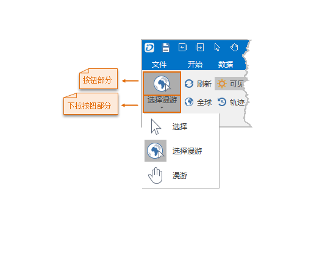

**使用说明**

“选择漫游”下拉按钮，用于设置场景窗口中的操作状态为选择、选择漫游或漫游状态。

  
 
  * **选择** ：设置场景窗口中的操作状态是否为选择对象的状态。若设置当前场景为选择对象的状态，即可在场景窗口中进行对象的选择。
  * **选择漫游** ：是在场景窗口中选择和漫游的操作状态同时存在，既可以选择场景中的对象，又可以漫游浏览场景。
  * **漫游** ：是在场景窗口中平移、旋转场景中的模拟地球。 

**操作步骤**

### 漫游

  1. 新建或打开一个场景窗口后，单击单击功能区 > “ **场景** ”选项卡 > “ **浏览** ”组中“ **选择漫游** ”项的下拉按钮部分，在弹出的下拉菜单中选择“ **漫游** ”项。将当前场景窗口的操作状态切换为漫游状态。
  2. 将鼠标移动到场景窗口中，鼠标状态变为  选择状态，即可以在当前场景窗口中进行漫游浏览操作。
  3. 在场景窗口中的地球表面适当的位置处按下鼠标左键并按住不放，同时拖动鼠标，随着鼠标的拖动，地球进行旋转；当场景窗口中显示的是地球表面放大的局部小区域，那么随着鼠标的拖动，场景窗口中的画面呈现平移的效果。
  4. 释放鼠标，完成一次漫游操作。若需要继续进行漫游操作，重复进行第2步的操作即可。

### 选择漫游

  1. 新建或打开一个场景窗口后，单击单击功能区 > “ **场景** ”选项卡 > “ **浏览** ”组中“ **选择漫游** ”项的按钮部分；或者单击“选择漫游”项的下拉按钮部分，在弹出的下拉菜单中选择“ **选择漫游** ”项。将当前场景窗口的操作状态切换为选择漫游状态。
  2. 在当前场景窗口中按住鼠标左键同时拖动鼠标时，即可平移场景，实现漫游操作；在可选择的对象上单击鼠标左键时，即可以选中该对象，实现选择操作。

### 选择

  1. 新建或打开一个场景窗口后，单击功能区 > “ **场景** ”选项卡 > “ **浏览** ”组中“ **选择漫游** ”项的下拉按钮部分，在弹出的下拉菜单中选择“ **选择** ”项。
  2. 将鼠标移动到场景窗口中，鼠标状态变为  选择状态，此时就可以在场景窗口中选择对象。   
可被选择的对象包括当前场景窗口中的点、线、面、文本、地标、模型。

  3. 直接单击要选择的对象即可选中该对象，选中的对象以高亮显示。
  4. 若继续选择其他对象，直接执行第3步的操作即可。选中新对象后，之前选中的对象自动撤销选中状态。
  5. 若要撤销对象的选中状态，可以在场景的其他位置（即没有可选择对象的位置），单击鼠标左键，即可取消选中状态。
  6. 若结束选择对象的操作，单击“浏览”组中的“选择漫游”按钮，切换选择状态为漫游状态，即可取消场景窗口中的选择对象状态。

**注意事项**

  1. 被选择对象所在的图层必须为可见、可选择图层，该对象才能被选中；否则，对象不能被选中。
  2. 在场景中一次只能选择一个对象。
  3. “选择”功能还可以通过当场景窗口中没有选择的对象时，在窗口单击鼠标右键，在弹出的菜单中“选择”按钮实现。
  4. 选中对象后，右键单击鼠标，在弹出的快捷菜单中选择“属性”项，即可在弹出的“属性”窗口中浏览选中对象的属性信息。
  5. 若对添加到当前场景的二维地图进行对象选择，则只支持对地图中的点、线、面、文本对象的选择（文本对象选中后不会高亮显示）。只有当原地图中的图层设为可选择状态，将地图添加至场景中才能进行对象选择。

**相关主题**

 [开启图层显示](../DTv_Visible)  

[开启图层选择](../DTv_Selectable)

 

