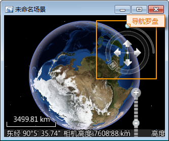
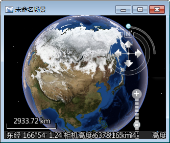

**使用说明**

“全球”按钮，用来将场景窗口中的模拟地球恢复为全球全景显示状态，即正北方向、垂直俯视视角的状态。

**操作步骤**

  1. 新建或打开一个场景窗口后，单击功能区 > “ **场景** ”选项卡 > “ **浏览** ”组的“ **全球** ”按钮，场景窗口中的地球将从当前状态变为指定的恢复状态。  
将场景窗口中的地球恢复为全球全景显示，正北方向，垂直俯视视角状态，其实质是执行了下面的操作，并且这些操作是同步进行的：

      * 在当前的地球状态下，对场景进行缩小或者放大操作，使场景中的地球全球全幅显示在场景窗口中；
      * 旋转地球，使地球的正北方向旋转到场景窗口的垂直正方向上；
      * 执行拉平竖起地球的操作，使地球处于垂直俯视的视角状态。

下图为执行全球操作的效果图，注意场景窗口中的导航罗盘的变化。（导航罗盘用来控制场景中地球所呈现的视角状态，以及放大缩小场景等操作。）

|   
---|---  

  2. 若需要再次进行全球操作，重复上一步操作即可。

**注意事项**

  1. “全球”功能还可以通过在当前窗口中无选择对象时，在窗口单击鼠标右键，在弹出的菜单中选择“全球”按钮，实现在当前场景中执行全球操作。

 

