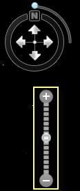
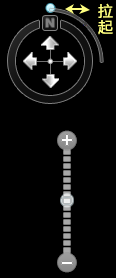
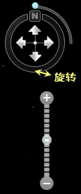

应用程序提供了方便的三维浏览功能，包括放大、缩小、倾斜、拉平、竖起、旋转等。通过使用场景中的三维导航工具，并配合使用鼠标键盘操作可以快速实现浏览操作。

### 场景浏览的鼠标键盘操作及其导航工具介绍

浏览功能 | 鼠标操作 | 键盘操作 | 导航工具条  
---|---|---|---|---
漫游 | 按下鼠标左键拖动 | 上下左右光标键 |   
放大/缩小 | 滚动鼠标中键或按下鼠标右键上下拖动 | PageUp键和PageDown键 |   
三维场景进行倾斜 | 按住鼠标中键上下拖动 | Shift键+上下光标键 |   
绕场景中心旋转 | 按住鼠标中键左右拖动 | Shift键+左右光标键 |   
  
* * *

