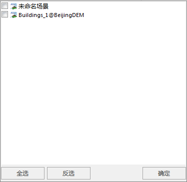
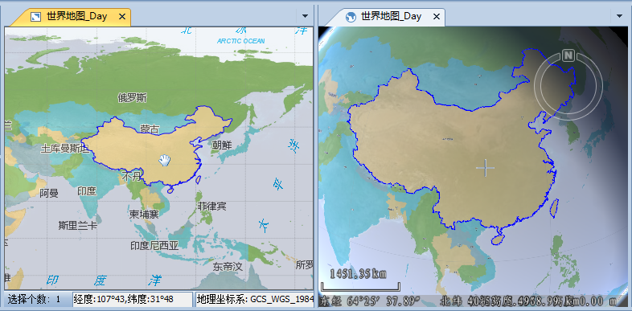

**使用说明**

　　“关联浏览”按钮用来将多个窗口进行绑定，从而使这些窗口的操作实现联动，例如：在相互绑定的某个窗口中漫游、缩放地图，从而改变窗口中显示内容的范围，那么，其他与之绑定的窗口也将自动变化到相应的显示范围。  
　　关联浏览功能支持两个以上窗口之间的联动，提供了地图窗口、场景窗口、属性窗口之间的相互绑定；同时在标签模式、叠加模式或扩展模式三种窗口模式情况下，都可实现关联浏览。

**操作步骤**

下面以地图窗口和场景窗口之间的绑定来描述如何实现关联浏览，使用的示范数据为：World.smwu。

  1. 新建一个场景，将当前工作空间中的 World 数据集添加到场景中。
  2. 打开要与场景绑定的地图，在地图窗口内打开示范数据中（World.smwu）的“世界地图_Day”。  
一般情况下，进行绑定的数据为相同区域范围内不同应用的数据，从而在一次浏览操作中可以实现同时查看一个区域的多类数据。

  3. 单击功能区 > “ **视图** ”选项卡 > “ **窗口** ”组的“ **关联浏览** ”按钮，弹出窗口列表，如下图所示。  
    
  4. 在绑定窗口列表中，勾选进行绑定的窗口前的复选框，如上图所示。
  5. 单击绑定窗口列表底部的“确定”按钮，此时应用程序自动对相互绑定的窗口进行水平排列，从而便于窗口间的联动操作与浏览。且各个窗口间的鼠标位置会以十字丝联动显示，如下图所示。  
    
  6. 接下来，就可以在其中一个窗口（如地图窗口）中进行漫游、缩放浏览操作，另一个窗口（如场景窗口）也将随之进行联动。

**备注**

  * 在当前工作空间中存在2个打开的地图、场景或者属性表窗口时，只选择一个窗口是无法进行关联的。
  * 当前窗口模式为标签模式、叠加模式或扩展模式时，都可保持当前的窗口模式进行关联浏览。
  * 当前工作空间中只保留一组关联关系，如果已经存在一组关联关系，然后又建立新的一组关联关系，则旧的关联关系会自动解除，只保留新的关联关系。
  * 关联浏览时，多个窗口的顺序与打开顺序有关，即按照窗口打开的顺序，按照从左到右，从上到下的顺序排列。
  * 当关联属性表浏览时，双击属性表中某条记录，场景窗口将快速定位至该对象。

  

 

