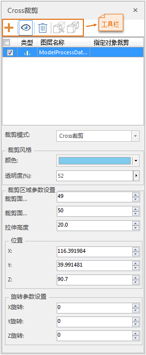
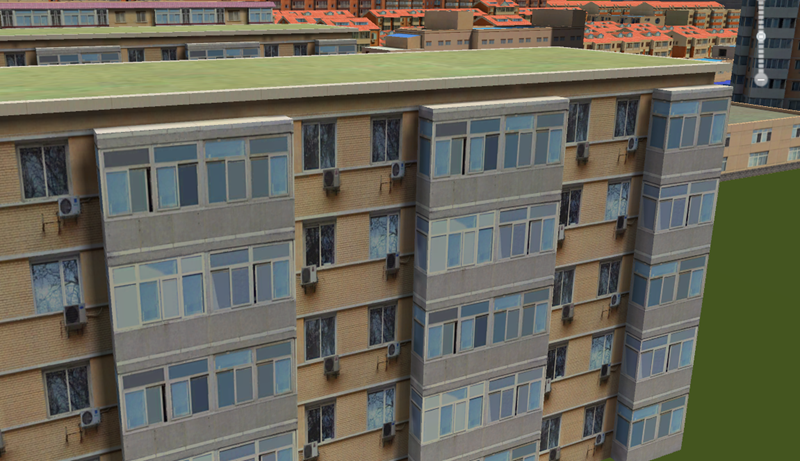
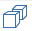
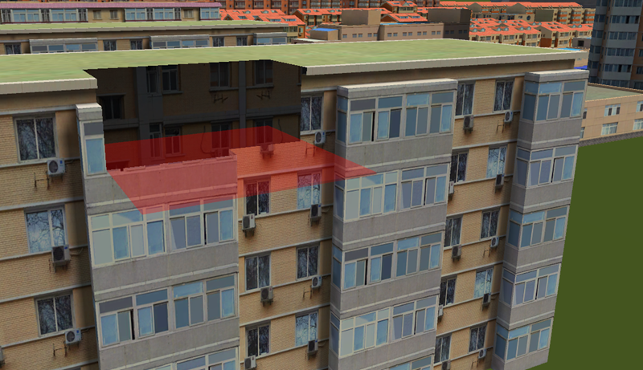

###  使用说明

“四边形裁剪”也叫“Cross裁剪”，该功能实现在场景中选定图层上绘制四边形，裁剪掉四边形所在范围内的数据。

###  操作步骤

  1. 在“ **场景** ”选项卡中“ **浏览** ”组中，单击“ **场景裁剪** ”下拉按钮，在弹出的下拉菜单中选择“ **Cross裁剪** ”，弹出“ **Cross裁剪** ”面板，如下图所示。  
  

  2. 在图层列表框中，勾选要进行四边形裁剪的图层，选中的待裁剪的图层效果如下图所示。  
    
  
  3. 若需要对精模缓存的子对象进行裁剪，则可单击工具栏中的指定对象裁剪按钮，单击精模缓存中需要进行裁剪的子对象，配合 **Shift** 键可以实现选择多个子对象。BOX裁剪窗口中“指定对象裁剪”文本框中会新增选中的子对象ID。若不需要直接进行步骤4即可。单击全部对象参与裁剪按钮即可退出指定对象裁剪进行全部对象参与裁剪操作。
  4. 单击工具栏中的添加裁剪区域  按钮，在场景中随鼠标移动实时显示红色四边形面，单击选择四边形面绘制的位置。待裁剪图层四边形裁剪效果如下图所示。
  5. 工具栏中“可见性”按钮可以控制裁剪的形状显示与否，选中“可见性”按钮，可以显示裁剪区域的形状，反之。默认为选中“可见性”按钮。  
    

  6. "四边形裁剪"面板中“裁剪区域参数设置”处可设置裁剪高度、裁剪宽度、拉伸高度、裁剪位置、旋转参数。各个参数，直接更改数值，场景中实时响应裁剪后效果。

 

