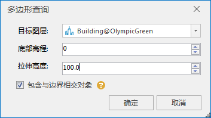

**使用说明**

“多边形查询”功能通过绘制多边形，设置选择图层、底部高程及拉伸高度实现场景框选。目前支持模型对象、点、线、面、三维点、三维线、三维面查询。

**操作步骤**

  1. 在“ **场景** ”选项卡上的“ **浏览** ”组中，单击“ **多边形查询** ”按钮，鼠标变为“+”号。
  2. 在图层中绘制多边形区域，鼠标右键结束绘制，弹出“多边形查询”对话框，如图所示。  
     
       * 目标图层：单击下拉箭头，选择进行多边形查询的图层。
       * 底部高程：直接输入或通过上下箭头调整底部高程值。
       * 拉伸高度：直接输入或通过上下箭头调整拉伸高度值。
       * 是否包含于边界相交对象：默认勾选，查询结果包含多边形边界处的完整对象；若取消勾选，表示只选择包含对象。
  3. 设置好多边形查询的参数后，单击“确定”进行查询操作，查询出的模型结果高亮显示。

 

