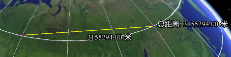
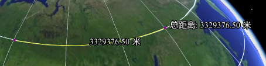
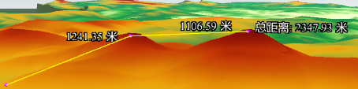
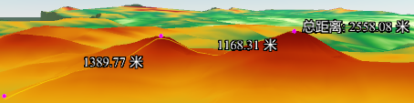

**使用说明**

SuperMap 提供了四种量算距离的方式：  
“ **空间距离** ”:适用于场景中具有一定高程物体之间的距离，该功能会根据起点和终点的空间位置计算出两者之间的空间距离。  
“ **依地距离** ”:在场景中的地形之上进行距离量算，该功能可以根据地形自动附着在地表之上计算出地表起伏的曲面距离。  
“ **水平距离** ”:当场景中有地形数据或模型数据时，该功能可以根据起点和终点的位置计算出两者之间的水平距离。  
“ **依对象距离** ”:当场景中有倾斜摄影数据或模型数据时，该功能可以根据起点和终点的位置计算出两者之间贴附与模型数据的距离。

**操作步骤**

三种量算的操作方式类似，本文以“空间距离”量算操作为例：  
  1. 首先设置距离量算时所使用的距离单位，通过“ **场景** ”选项卡中“ **量算** ”组的“ **单位** ”进行距离单位的设置，系统默认单位为：米。
  2. 单击“ **场景** ”选项卡中“ **量算** ”组中“ **距离** ”项的下拉按钮，在弹出的下拉菜单中选择“ **空间距离** ” 。
  3. 将鼠标移动到场景窗口中，鼠标状态变为  选择状态，此时即可在场景中的地球表面进行距离量算。
  4. 在地球表面的适当位置单击鼠标左键，确定量算的起始点，此时移动鼠标，屏幕上会出现连接鼠标当前点和起始点的长度不断变化的临时线，同时还显示了量算结果 数值，在量算的过程中结果有两个数值，分别为：“当前长度”，即当前鼠标点与前一鼠标点之间的距离数值；“总长度”，即当前鼠标点与量算的起始点间所确定的量算路径的总长度。
  5. 连续单击鼠标左键，确定量算的其他点，并且在地球表面留下了由已经确定的点构成的量算路径，同时，显示了相邻两点间确定的量算路径的距离值。
  6. 结束距离量算，单击鼠标右键即可，长度量算的相应位置出现当前长度和总长度的数值注记，输出窗口中也显示出长度量算的数值。
  7. 单击“ **量算** ”组中的“ **清除** ”按钮 ，即可清除当前场景窗口中长度量算的数值注记。
  8. 若想要删除某个具体量算结果，可单击“ **点选删除** ”进行操作。若难以选中某个具体的量算线，可选择量算距离结果数字框实现删除。
  9. 若需要继续进行距离量算，重复第 1 步至第 7 步的操作。

###  结果对比与区别

场景数据 | 量算方式 | 量算结果 | 结果示例  
---|---|---|---  
无地形数据 | 空间距离 | 不考虑地球表面地形起伏的光滑地球的空间直线距离 |
  
  
依地距离 | 不考虑地球表面地形起伏的光滑地球的空间球面距离 | 
  
  
有地形数据 | 空间距离 | 量算的过程中，量算的距离为依地形高程的空间直线距离。 |
  
  
依地距离 | 量算的过程中，量算的距离为依地形起伏的曲线距离。 |
  
  
**注意事项**

  1. 在场景中量算距离，只能在地球表面量算，在地球以外的场景窗口的其他区域，距离量算无效。
  2. 当在场景中进行依地量算时，若量算的区域没有地形数据，量算的距离为光滑球体的球面距离，即不考虑地球表面地形起伏的光滑地球的球面距离。
