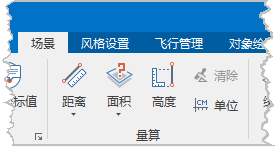

“ **场景** ”选项卡上的“ **量算**
”组，组织了在场景中的地球表面进行各种量算的功能，包括量算距离、量算面积、量算高程，设置量算单位以及清除场景中的量算结果。

  
---  
图：“场景”选项卡中的“量算”组  
  
下面详细介绍“量算”组中的各按钮对应的功能和操作方式：

 [距离](MeasureDistance3DBut  )

 [面积](MeasureArea3DBut  )

 [高程](MeasureAltitude3DBut  )

 

