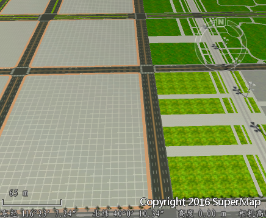
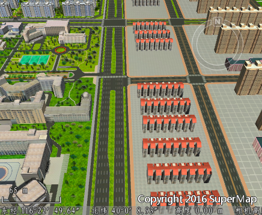
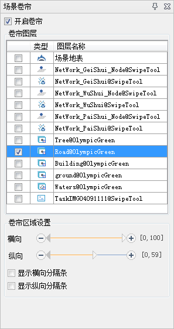
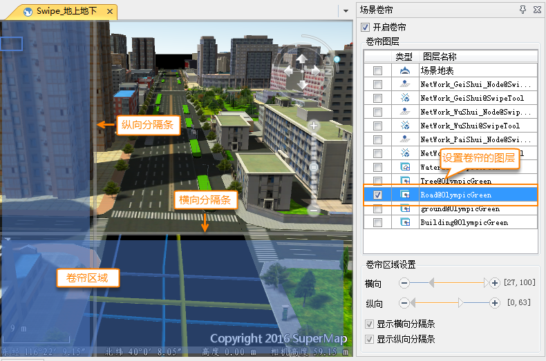
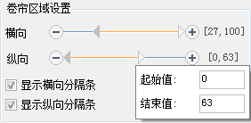

**使用说明**

“场景卷帘”功能，通过对指定的图层设定卷帘区域，以达到对比查看同一区域不同时期或者地上地下的场景浏览效果。 
例如，在地上场景浏览时，也需要看到浏览区域内地下管线的铺设情况，就可以对道路图层设置卷帘，同时开启地下，设置地下透明度，就能在浏览时达到想要的效果。如下图中所示，就是对道路图层设置了卷帘区域，并开启地下、设置透明度为100%（全透明），而得到的场景显示效果。  
除此之外，利用卷帘效果，也可以查看同一地区在不同时间段的变迁对比。如下面的对比图片所示，将较新时期的模型数据和旧时期的模型数据同时添加在场景中，对较新时期的模型数据设定横向的卷帘区域，在场景进行横向浏览时，就能看到显示区域的变迁。

 |   
---|---  

  
**注意**
：卷帘功能支持的数据类型有：倾斜摄影数据，管线数据集，管线OSGB缓存，管线SCV缓存，模型数据集，模型OSGB缓存，模型SCV缓存，CAD数据集，非贴地矢量数据；不支持的数据类型有:贴地矢量面，地形数据，影像数据。

对数据设置卷帘后，建议结合飞行功能使用，能得到更好的场景浏览体验。

**操作步骤**

  1. “ **场景** ”选项卡中，单击选择“ **场景卷帘** ”，弹出“场景卷帘”对话框，如下图所示。
    
**开启卷帘** ：设置场景是否开启卷帘效果。如果已经对图层设置了卷帘效果，不勾选时图层将恢复没设置卷帘之前，再次勾选后，图层设置的卷帘效果出现。  
**卷帘图层** ：使用列表方式罗列了当前场景中加载的所有图层。勾选复选框，表示对图层设置卷帘效果。

  2. 对图层设置卷帘区域。  
卷帘区域分为横向、纵向两个方向。只有当勾选了要设置卷帘效果的图层，卷帘区域设置可用。设置卷帘区域使用进度条的方式展现，默认分隔条不显示在场景中。如下图所示，为场景中图层的卷帘区域与横向、纵向分隔条设置区域的对应关系。

      
横向、纵向分隔条的值域，是以当前显示的场景窗口为参照而给出的左上角为[0,0]、右下角为[100,100]的虚拟区域，以百分比的方式计算。例如，上图中所示的横向分隔条值域为[27,100]，代表场景窗口的27%以下是设置了卷帘的区域，27%以上的区域是没有设置卷帘的区域。也可以通过横向、纵向分隔条中的颜色区分卷帘的设置范围，蓝色部分代表设置了卷帘的区域，橙色部分代表没有设置卷帘的区域。  
另外，卷帘范围的设置，可以通过点击或者拖动滑块的方式，也可以直接在值域范围上点击，直接输入数值设置，如下图中所示。  
  

**注意事项**

场景卷帘功能，对数据分层有一定要求，要展示出较好的场景卷帘效果，建议在制作数据时能够细化分层。

**相关主题**

 [场景卷帘设置实例](SwipeTool_Example  )

 

