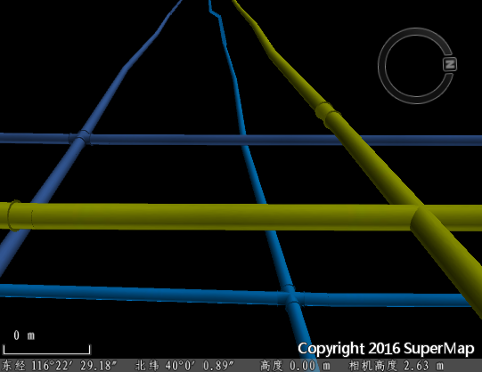
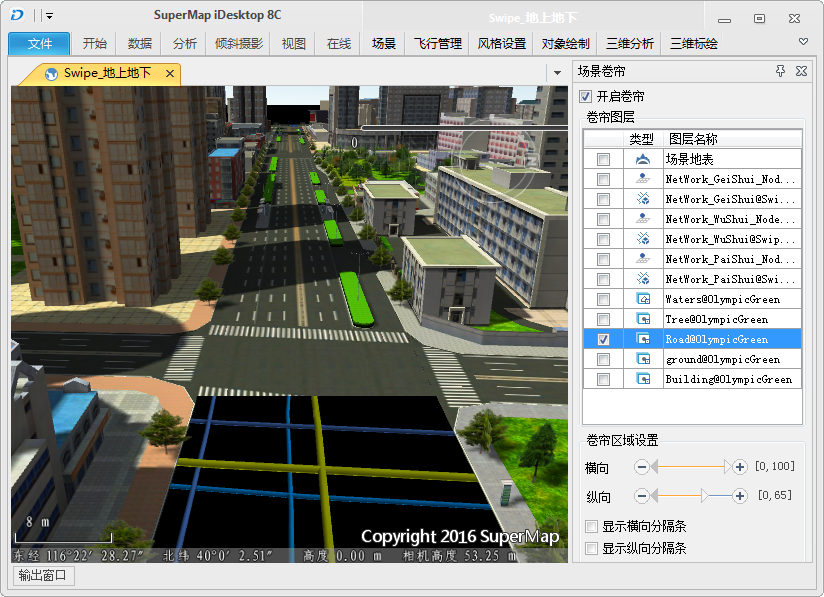

本实例中使用鸟巢地区的地上模型数据和地下管线数据，通过对道路层设置卷帘，达到沿指定路线飞行时可以同时看到地上模型、地下管线的场景浏览效果。

**数据说明** ：

本例中使用的鸟巢地区模型数据，是对示范数据OlympicGreen中的模型数据集分别提取出建筑物、树、水面、地面、道路五个图层，并生成SCV缓存，在场景中直接加载生成的缓存数据，提高场景浏览效率。使用的地下管线数据，为由三维点、三维线创建的三维网络数据集，这里使用了三种类型的管线：排水、给水和污水。

**操作步骤** ：

1.新建场景，将生成的SCV缓存数据、管线数据添加到当前场景中。当前场景中添加三维缓存，请参见：[加载三维缓存](../LayersManagement/CacheButton)   

2.设置管线风格。以排水管线为例，将排水管线网络数据集添加到三维场景中，图层管理器中选中网络线子数据集，在“ **风格设置** ”选项卡“**拉伸设置** ”组中设置高度模式为“绝对高度”，数据来自“地下”，在“ **线风格**”组中设置为圆管风格，修改颜色为蓝色，并设置线宽为1。对网络节点子数据集，设置高度模式为“绝对高度”，数据来自“地下”。对其他的两个管线网络数据集也做同样的风格设置，给水管线也为蓝色风格，污水管线为黄色风格。

3.开启地下，并将透明度设置为100%，显示效果如下图所示。  
  
  
4.对道路图层设置卷帘。“ **场景** ”选项卡中，点击选择“ **场景卷帘** ”，在弹出的对话框中，“ **卷帘图层**”中勾选Road图层前的复选框，表示对此图层设置卷帘。在“ **卷帘区域设置中**”，设置横向区域为[0,100],纵向区域为[0,65]，不显示横向、纵向分隔条。调整相机角度，得到场景效果图如下图所示。   
    
卷帘区域设置的详细信息，请参见[场景卷帘](SwipeTool  )中“ **卷帘区域设置** ”内容。

5.设置飞行路线。场景卷帘与飞行路线结合，能得到更好的场景浏览体验，飞行路线的详细设置，请参见：[三维飞行模拟](../FlyManager/FlyManager)。

本实例列举的是通过设置道路图层的纵向卷帘区域，展示同一个场景中同一个相机高度下，地上地下数据的同时浏览效果。同样的，通过设置图层的横向卷帘区域，能实现时间维度上的历史变迁浏览效果，或者其他更多的自定义场景浏览体验。

**相关主题**

 [场景卷帘](SwipeTool  )

 

