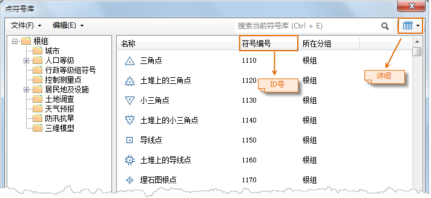

---
id: CustomizeMap3DGroupDia
title: 修改三维自定义专题图  
---  
### 使用说明

用户可在“自定义专题图”窗口中，修改三维自定义专题图的各项参数设置，实现更符合需求的专题图效果。

### 操作步骤

  1. 在图层管理器中选中某一个三维自定义专题图图层，单击“自定义”组框中“新建”按钮，在弹出的“自定义专题图”窗口中显示了选中的自定义专题图的设置信息。
  2. **专题图图层：** “自定义专题图”窗口中的“专题图图层”项，用于设置和显示“自定义专题图”窗口中当前呈现和编辑的专题图内容。
      * 单击“专题图图层:”项右侧组合框的下拉按钮，弹出的下拉列表中列出了当前地图中所有的专题图图层；
      * 在下拉列表中，选择要修改设置的自定义专题图图层为当前专题图图层，则“自定义专题图”窗口中的内容会根据选择的专题图图层发生变化。

**基于面图层、线图层、点图层分别制作三维自定义专题图时，“自定义专题图”窗口中显示的内容分别如下图所示，其设置略有差异。**

|
  
基于面图层制作三维自定义专题图| 基于线图层制作三维自定义专题图| 基于点图层制作三维自定义专题图  
  3. **属性：** “自定义专题图”窗口中的“属性”项，用于设置“自定义专题图”中填充风格，线型风格，符号风格及高度模式。填充风格对于面矢量专题图层中的面对象有效，线型风格对于线矢量专题图层中的线对象及面矢量专题图层中的面对象边线有效，符号风格对于点矢量专题图层中的点对象有效，高度设置则可用于点、线、面矢量专题图层。
  1. **填充：** 设置面图层中面对象的渲染风格。
      * **填充风格：** 选择一个数值型字段或表达式，根据该字段或表达式的值与资源填充库中ID对应的风格来填充该对象。例如设置完一个填充风格字段后，一个对象所对应的该字段值为8，则系统会到资源填充库中去搜索 ID 号为8的填充风格，然后使用该风格来渲染该对象。需要注意：目前自定义专题图的填充风格暂时只支持设置三维符号。
      * **填充前景色：** 选择填充符号的前景色的字段表达式。例如若设置填充前景色的值为蓝色，蓝色的十六进制数值为#0003E8，则将该十六进制的数值换算为十进制的数值为1000，最终显示为蓝色。 
      * **填充模式：** 择一个数值型字段或表达式，系统会根据该字段的值选择对应的填充模式，当字段值为1表示区域填充，字段值为2表示轮廓填充，字段值为3表示轮廓与区域填充。当字段值不为1或2或3时，采用默认字段值1，即采用区域填充模式。 
  2. **线型：** 设置线型符号或者拉伸轮廓线的渲染风格，或者面图层中面对象边线的渲染风格。
      * **线型风格：** 选择一个数值型字段或表达式，根据该字段或表达式的值与资源线型库中 ID 对应的风格来渲染该对象。例如设置完一个线型风格字段后，一个对象所对应的该字段值为8，则系统会到资源线型库中去搜索编码号为8的线型风格，然后使用该风格来渲染该线对象。
      * **线型颜色：** 选择一个数值型字段或表达式，根据该字段或表达式的值来设置线型或拉伸轮廓线的颜色。例如若设置轮廓线颜色为蓝色，蓝色的十六进制数值为#0003E8，则将该十六进制的数值换算为十进制的数值为1000，最终显示为蓝色。
      * **线型宽度：** 选择一个数值型字段或表达式，根据该字段或表达式的值来设置所选线型的宽度，单位为0.1mm。
  3. **符号：** 设置点图层中点对象的渲染风格。
      * **符号风格：** 选择一个数值型字段或表达式，根据该字段或表达式的值与资源符号库中ID对应的风格来渲染该对象。例如设置完一个符号风格字段后，一个对象所对应的该字段值为8，则系统会到资源符号库中去搜索编码号为8的符号风格，然后使用该风格来渲染该点对象。
      * **符号颜色：** 选择一个数值型字段或表达式，根据该字段或表达式的值来设置点模型符号颜色。例如若设置符号颜色为蓝色，蓝色的十六进制数值为#0003E8，则将该十六进制的数值换算为十进制的数值为1000，最终显示为蓝色。
      * **图标文件：** 选择一个文本型字段或者表达式，根据该字段或表达式的值设置图标文件的全路径。注意：使用表达式的方式指定图片路径时，需要加上英文的双引号。
      * **图标缩放：** 选择一个数值型字段或表达式，根据该字段或表达式的值来设置图标文件缩放比率。
      * **布告板模式：** 选择一个数值型字段或表达式，根据该字段或表达式的值设置地标布告板模式，当字段值为1表示屏幕对齐布告板，为2表示Z轴对齐布告板，为3表示固定旋转角度对齐布告板。当字段值不为1或2或3时，采用默认字段值1，即采用屏幕对齐布告板模式。 
      * **模型符号旋转：** 选择一个数值型字段或表达式，根据该字段或表达式的值来设置三维模型符号绕 X 或 Y 或 Z 轴的旋转角度。
      * **模型符号缩放：** 选择一个数值型字段或表达式，根据该字段或表达式的值来设置三维模型符号 X 或 Y 或 Z 轴方向的缩放比例。

### 备注

  1. 在设置面符号的透明度时，需要注意一点：面填充符号的透明度属性取决于面对象 **填充前景色** 字段中设置的透明度，而不是面对象的边界线的 **线型颜色** 中设置的透明度。
  2. 对点图层制作自定专题图，不仅支持三维点，而且支持复合点（EPS点）。
  3. 用户制作和修改的自定义专题图都可以保存为模板，以便应用到其它图层的专题图制作中，保存专题图模板具体参见：

[保存到专题图模板库](../../Mapping/Methods/VLabTheme2_SaveThemeTempl)。

  4. 字段及表达式的值是与符号库 ID 值对应的。以点符号库为例，打开工作空间 -> 符号库 -> 填充符号库，ID 值的查看方法见下图：   
 
  
###  相关主题

 [新建三维自定义专题图](CustomizeMap3DDefault)

 [基于模板制作三维自定义专题图](CustomizeMap3DTemplate)

