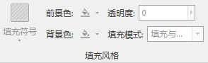
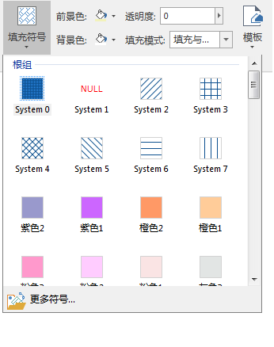

---
id: Fill3Dgroup
title: 设置面图层的风格  
---  
### 使用说明

“ **风格设置** ”选项卡的“ **填充风格**
”组，组织了对场景中矢量数据集类型的三维图层中的面状对象进行风格设置的功能。所有填充风格的设置都会实时应用到选中的三维图层中，即所见即所得。

  

  
可进行风格设置的面对象包括以下几种类型：

1. 面数据集类型的三维图层：可对面矢量数据集中的面对象设置填充风格；此外，当面对象被垂直拉伸为三维体对象时，填充风格设置还可应用于拉起后产生的三维体对象的其他面。
2. 线数据集类的三维图层：当线矢量数据集被垂直拉起时，填充风格设置可应用于线数据集垂直拉起后所产生的面。

注意：只有当前图层为符合要求的矢量数据集类型的三维图层，“填充风格”组中的所有功能控件才可用；否则，这些功能控件将不可用。

### 操作步骤

### 填充风格

“填充符号”功能将用于设置三维场景中面数据集的填充符号的样式。

1. 单击“ **风格设置** ”选项卡中“ **填充风格** ”组的“ **填充符号** ”项的下拉按钮，弹出填充符号资源列表（如下图所示）。列表的上部分显示出了用户最近使用的符号，列表的下部提供了系统默认的根组符号库，用户可根据需要选择符号列表中的符号作为当前场景面图层中面对象的符号样式；
2. 用户还可以单击面填充资源列表底部的"更多符号"按钮，在弹出的“填充符号选择器”窗口中，设置面对象的符号样式。
3. 当用户选择了某个填充符号样式后，当前场景线图层中的所有面对象都会按选中的填充符号样式在三维球体实时显示。  
  

### 填充颜色

“前景色”标签右侧的按钮用于设置矢量图层中填充符号的前景色，即设置填充符号本身花纹的颜色。通过单击右侧的颜色按钮，在弹出的颜色面板中选择和设置填充颜色。

“背景色”标签右侧的按钮用于设置矢量图层中填充符号的背景色，即设置填充符号背景颜色。通过单击右侧的颜色按钮，在弹出的颜色面板中选择和设置填充颜色。

### 透明度

“透明度(%)”功能用于设置面填充的透明效果。用户可以在该标签右侧的数字显示框中输入数值来设置；也可以单击数字显示框右侧的箭头，调整弹出的滑块来设置透明度。透明度的数值为
0 至 100 之间的任意一个整数，0 代表完全不透明；100 代表完全透明。    

  
### 填充模式

“填充模式”功能用于设置面的填充模式。单击该标签右侧的下拉按钮，可在弹出的下拉菜单中选择一种面填充模式，应用于当前三维图层。填充模式分为三种：

* 轮廓: 只显示面的轮廓线（边界线），而不显示面的填充内容。
* 填充: 只显示面的填充内容，而不显示面的轮廓线（边界线）。
* 填充与轮廓: 面的轮廓线（边界线）和面的填充内容同时显示。

### 注意事项

对于填充风格，三维场景中不支持“背景透明”的设置，即在在三维场景窗口中弹出的“风格设置”窗口中"背景透明"控件不可用。

在非贴地高度模式下，对三维场景中的面几何对象或拉伸面设置填充符号无效，在场景中显示时仍然使用编号为0的填充符号。

###  相关主题

 [保存为风格模板](../SceneTemplate/DTv_StyleSave)

