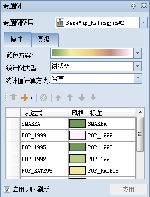
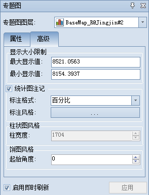
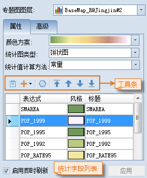
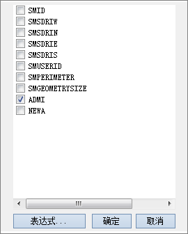
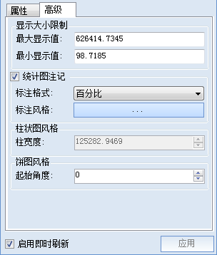

---
id: GraphMap3DGroupDia
title: 修改三维统计专题图  
---  
### 使用说明

“三维统计专题图”窗口用来管理场景中所有的三维专题图层，在“三维统计专题图”窗口中可以修改专题图的设置内容，从而改变原有的专题图获得新的更符合用户需求的专题图。

利用“三维统计专题图”窗口可以修改某个三维统计专题图的设置，具体通过窗口中提供的设置项目来实现的，下面的操作步骤中会详细介绍各个项目的作用与设置方式。

### 操作步骤

  1. 选择某一个三维统计专题图图层为当前图层，然后双击该专题图层，将弹出“三维统计专题图”窗口，窗口中当前显示的为选中的这个三维统计专题图的设置信息。 
  2. **专题图图层** ：“三维统计专题图”窗口中的“专题图图层:”项，用于设置和显示“三维统计专题图”窗口中当前呈现和编辑的三维专题图内容。
      * 单击“专题图图层:”组合框的下拉按钮，弹出的下拉列表中列出了当前场景中所有的三维专题图图层。
      * 在下拉列表中，选择要修改设置的专题图图层为当前专题图图层，则“三维统计专题图”窗口中的内容会根据选择的专题图图层类型发生变化，这里选择要修改设置的三维统计专题图图层。

      基于面矢量数据集类型的三维图层制作三维统计专题图时，“三维统计专题图”窗口中显示的内容如下图所示。  

         
        
      **“三维统计专题图”窗口包含两个选项卡页，分别为“属性”和“高级”。具体介绍如下：**

      ### “属性”选项卡：

      用于设置当三维统计专题图中的统计图的风格样式，在该选项卡中的所有设置都会实时反映到当前三维统计专题图中，即所见即所得。  
        
 
  3. **颜色方案：** “颜色方案:”组合框下拉列表中列出了系统提供的颜色方案，选择需要的配色方案，则系统会根据选择的颜色方案自动分配每个渲染字段值所对应的专题风格。 用户可通过单击该组合框右侧的下拉按钮，在弹出的下拉列表中选中某一个颜色方案，当前三维统计专题图的每个统计字段根据颜色方案的颜色变化模式被赋予不同的颜色。
  4. **统计图类型：** 目前，系统提供3种三维统计图供用户选择：柱状图、饼状图、堆叠柱状图。用户可通过单击“统计图类型:”项右侧的下拉按钮，在弹出的下拉列表中选择所需的统计图类型。
  5. **统计值计算方法：** 用于确定统计图的大小以及统计图中各专题变量所占的比例。系统提供了3种统计值计算方法：常量、对数和平方根。对于有值为负数的字段，不可以选择对数和平方根的统计值计算方法。
      * **常量：** 按属性表中原始数值的线性比例进行分级运算。
      * **对数：** 按属性表中原始数值自然对数的线性比例进行分级运算。
      * **平方根：** 按属性表中原始数值平方根的线性比例进行分级运算。
  6. **添加或移除字段：** 统计专题图可以通过统计图表达一个或多个字段值。用户可通过“属性”选项卡中部的工具栏上的“添加”和“移除”按钮对当前统计专题图添加统计字段或移除统计字段。当前统计专题图将实时根据修改后的专题变量重新进行配图，并刷新显示效果。

添加或移除字段的操作方法

  * **添加字段：** 单击工具栏的“添加”按钮的下拉按钮，在弹出的该专题图图层的所有字段列表中（如下图所示），单击需要添加的统计字段前面的方框，或者是单击字段列表中“表达式…”项，在弹出的“[SQL 表达式](../../Query/SQLDia)”对话框中构建字段表达式作为统计专题图的统计字段。   
  
  * **移除字段：** 在“属性”选项卡下部的统计字段列表中，选中需要移除的一条或多条统计字段，单击工具栏的“移除”按钮 ，即可移除不需要的统计字段。
7. **统计图风格设置：** 通过“属性”选项卡中部的工具栏中风格设置按钮，或单击字段列表中每个字段中的风格设置按钮，设置统计图的风格样式。 
    * “风格”按钮：选中统计字段列表中一个，单击该按钮，可在弹出的 “填充符号选择器”窗口（具体操作步骤请参见：[设置填充符号风格](../../Visualization/LayerStyle/FillSymStyle)中，设置选中字段的统计符号的填充风格。用户也可以直接单击字段列表中对应字段的“风格”项，修改该字段统计符号的风格。
    * 当使用 Shift 键选择多个字段时，单击“风格”按钮，弹出“修改专题图项风格”对话框，可在此选择要修改的属性项，进行批量修改。具体操作请参见：[修改专题图项风格](Thematic3DSymbolStyle)。
8. **上下移动字段：** 用户可通过“属性”选项卡中部的工具栏中4个移动字段的按钮，更改列表框中选中字段在列表中的位置。字段在列表框中的位置会影响其在制作的统计专题图中的位置。 

字段移动按钮的操作方法

  * 置顶按钮，将选中字段向上移至字段列表顶层。
  * 上移按钮，将选中字段向上移动一个位置。
  * 下移按钮，将选中字段向下移动一个位置。
  * 置底按钮，将选中字段向下移至字段列表底层。

### “高级”选项卡：

用于对当前三维统计专题图中的统计图进行高级参数设置。    
   

5. **“显示大小限制”区域：** 设置三维统计专题图统计符号显示的最大值与最小值，所有统计图的显示大小均在最大、最小值之间逐渐变化。应用程序会自动计算合适的最大显示值和最小显示值，计算思路与二维统计图的计算思路类似，推荐使用默认值，取值单位为米。 
    * **最大显示值：** 设置最大统计对象的统计符号的显示大小。
    * **最小显示值：** 设置最小统计对象的统计符号的显示大小。
6. **“统计图注记”区域：** 可设置是否显示统计图上的文本标注。若需要添加统计图注记，选中该复选框，"标注格式”组合框和“标注风格”按钮为可用状态，用户可以设置统计专题图文本显示格式以及文字标注风格。 
   * **标注格式：** 系统提供的统计专题图文本显示格式有5种：百分数、真实值、标题、标题 + 百分数、标题 + 真实值。用户可根据需要选择当前统计图上标注的文本格式。 
    * **标注风格：** 设置当前统计图上标注文本的风格。用户可通过单击该标签右侧的按钮，在弹出的文本风格对话框中设置统计图文本标注的风格。 
7. **柱状图风格：**
    * **柱宽度：** 用于设置柱状统计图每一个柱的宽度，默认值为当前柱状图最大宽度的一半。用户可在该标签右侧的数字显示框中设置所需的柱状图宽度，数值可以在0与最大宽度之间进行，否则设置无效。
8. **饼图风格：** 用来设置饼图的起始角度。 
    * **起始角度：** 设置饼图的起始角度，默认为水平正向。
9. 在“统计专题图”窗口中的各项参数设置都会实时反映到当前场景中相应的专题图图层，即实现所见即所得。用户也可以通过取消勾选对话框底部的“启用即时刷新”复选框，不启用实时刷新。若不勾选“启用即时刷新”复选框，则用户完成各项参数设置后，可单击对话框底部的“应用”按钮，将对话框中的参数设置应用于当前专题图。 

### 备注

* 用户制作和修改的三维统计专题图都可以保存为模板，以便应用到其它图层的专题图制作中，保存专题图模板具体参见：[保存到专题图模板库](Theme_SaveThemeTempl)。

* 在使用模板方式制作专题图时，用户可以直接在“模板”下拉按钮的下拉菜单中，选择已保存的模板将其应用到其它专题图的制作中。

###  相关主题

 [新建三维统计专题图](GraphMap3DDefault)

 [基于模板制作三维统计专题图](GraphMap3DTemplate)

