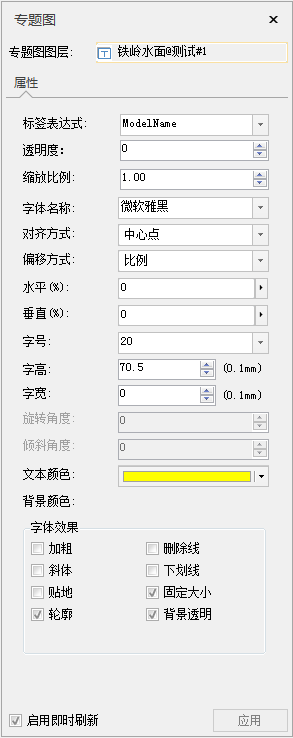

---
id: LabelMap3DGroupDia
title: 修改三维标签专题图  
---  
### 使用说明

“三维标签专题图”窗口用来管理场景中所有的三维专题图层，在“三维标签专题图”窗口中可以修改专题图的设置内容，从而改变原有的专题图获得新的更符合用户需求的专题图。

当当前场景中存在三维标签专题图，则“三维标签专题图”窗口可双击“图层管理器”中的三维标签专题图图层弹出，并且窗口中显示的是该三维标签专题图的设置信息。

用户通过制作和修改的三维专题图都可以保存为模板，以便应用到其他三维图层的专题图制作中，保存专题图模板具体操作请参见：[保存到专题图模板](Theme_SaveThemeTempl)。

### 操作步骤

1. 选择某一个三维标签专题图图层为当前图层，然后双击"图层管理器"中的三维标签专题图图层弹出“三维标签专题图”窗口，窗口中当前显示的为选中的这个三维标签专题图的设置信息。
2. **专题图图层** ：“三维标签专题图”窗口中的“专题图图层:”项，用来设置和显示“三维标签专题图”窗口中当前显示和编辑的三维专题图内容。

具体操作：

* 单击“专题图图层:”项右侧的组合框的下拉箭头，弹出的下拉列表中列出了当前场景中的所有三维专题图图层，包括三维标签专题图、三维单值专题图和三维分段专题图。
* 在下拉列表中，选择要修改设置的专题图图层为当前专题图图层，则“三维标签专题图”窗口中的内容会根据选择的专题图图层而发生变化，这里选择要修改设置的三维标签专题图图层。
  

3. 修改标签专题图的字段表达式。标签表达式用来显示和设置当前三维标签专题图所基于的标注字段或者字段表达式。

    如何修改标签表达式

    1. 单击“标签表达式”项右侧的组合框的下拉按钮，弹出的下拉列表中列出了用来制作当前三维标签专题图的矢量数据集的所有属性字段。
    2. 在下拉列表中，选择当前三维标签专题图图层所使用的标注字段；如果用户想使用字段表达式，则选择下拉列表中的“表达式...”项，在弹出的“SQL 表达式”对话框中构建三维标签专题图所基于的字段表达式。
    3. 当前三维标签专题图将根据修改后的标签字段表达式重新进行标注。
    4. 修改标签专题图字体的显示风格，包括标签注记字体的透明度、缩放比例、字体颜色、字体效果等等。

    标签专题图字体风格的参数

    **透明度**

    显示和设置当前三维标签专题图中标签的透明效果。通过在右侧的文本框中输入透明度数值来设置，输入数值的范围为 0 至 100 之间的整数值，100
    代表完全透明；0 代表完全不透明。

    **缩放比例**

    显示和设置当前三维标签专题图中标签的字体的缩放比例。通过在右侧的文本框中输入数值来设置。默认缩放比例为1。

    **字体名称**

    用于设置标签专题图中标签文本所使用的字体。该标签控件右侧的组合框下拉列表中提供了丰富的字体供用户选择，同时提供了“最近使用的字体”分组，方便选择最近使用的字体名称。系统支持键盘快速首字母定位字体。例如在键盘上单击字母“T”，则在下拉列表框内会显示以字母"T"开头的字体。单击该标签控件右侧的组合框下拉列表，选择一种字体。默认字体为微软雅黑。

    **对齐方式**

    用于通过设置标签专题图中文本对象与其锚点的相对位置来确定文本对象的摆放位置。该标签控件右侧的组合框下拉列表中列出了多种对齐方式。系统共了12种对齐方式，其中包括了三种基于基线的对齐方式。单击该标签控件右侧的组合框下拉列表，选择一种对齐方式。默认为左上角对齐。

    **水平**

    用于设置标签专题图中文本标注与锚点的水平偏移量，水平偏移量值域为[-100%，100%]，正值表示往右偏移，负值表示往左偏移，100%为一个文本的宽度，与字号大小和字宽有关。

    **垂直**

    用于设置标签专题图中文本标注与锚点的垂直偏移量，垂直偏移量值域为[-100%，100%]，正值表示往上偏移，负值表示往下偏移，100%为一个文本的高度，与字号大小和字高有关。

    **字号**

    用于设置标签专题图中标签文本字体的大小，用户既可以输入字体大小的数值，也可以从该标签控件右侧的组合框下拉列表中选择合适的字体大小。

    **字高**

    用于设置标签专题图中标签文本字体的高度，可以通过该标签控件右侧的文本框中输入数值,也可以使用文本框中的上下微调按钮来调整文本框中的数值。

    **字宽**

    用于设置标签专题图中标签文本字体的宽度，可以通过在该标签控件右侧的文本框中输入数值也可以使用文本框中的上下微调按钮来调整文本框中的数值。

    **旋转角度**

    用于设置三维标签专题图中标签对象（文本对象）的旋转角度。需要与“字体效果”中的“贴地”复选框配合使用。勾选“贴地”复选框时，可以设置旋转角度，否则此项不可用。可以通过在该标签控件右侧的文本框中输入数值也可以使用文本框中的上下微调按钮来调整文本框中的数值，数值单位为度，逆时针方向为正方向。

    **倾斜角度**

    需要与“字体效果”设置区域的“斜体”复选框配合使用，即需要将三维标签专题图中标签对象（文本对象）中的字体效果设置为斜体时，才可以设置倾斜角度。“倾斜角度”项用于控制字体的倾斜程度，可以通过该标签控件右侧的文本框中输入数值，也可以使用文本框中的上下微调按钮来调整文本框中的数值，数值可以为正数也可以为负数，单位为度。当倾斜角度为0时，为系统默认的字体倾斜风格。字体效果中的“斜体”复选框没有勾选，该项不可用。

    **文本颜色**

    用于设置标签专题图中标签对象（文本对象）中文本的颜色，单击该标签右侧的按钮，弹出“颜色”对话框，可以选择和设置合适的颜色。

    **背景颜色**

    用于设置标签专题图中标签对象（文本对象）中文本的轮廓或背景颜色，单击该标签右侧的按钮，弹出“颜色”对话框，可以选择和设置合适的颜色。只有勾选“文字效果”设置区域的“轮廓”复选框或不勾选“背景透明”复选框时，标签对象的“背景颜色”按钮才为可用状态。勾选“轮廓”按钮时，才会显示文本的轮廓颜色，否则文本无轮廓；不勾选“背景透明”按钮时，才会显示文本的背景颜色，否则，文本背景透明，所设置的背景颜色效果不可见。

    **字体效果**

    设置三维标签对象的字体显示效果，包括加粗、斜体、轮廓、阴影、下划线、删除线、背景透明、固定大小等。

    **加粗**

    “字体效果”设置区域的“加粗”复选框用于控制标签专题图中标签对象（文本对象）中的字体是否使用粗体。当勾选该复选框时，表示字体为粗体显示；若不勾选该复选框，则字体不以粗体显示。

    **删除线**

    “字体效果”设置区域的“删除线”复选框用于控制标签专题图中标签对象（文本对象）中的文字是否添加删除线。当勾选该复选框时，表示文字有删除线；若不勾选该复选框时，文字没有删除线。

    **斜体**

    “字体效果”设置区域的"斜体"复选框用于控制标签专题图中标签对象（文本对象）中的字体是否使用斜体。当勾选该复选框时，表示字体采用斜体显示，若不勾选该复选框时，则字体不以斜体显示。

    **下划线**

    “字体效果”设置区域的“下划线”复选框用于控制标签专题图中标签对象（文本对象）中的文字下方是否添加下划线。当勾选该复选框时，表示文字下方有下划线；若不勾选该复选框时，文字下方没有下划线。

    **贴地**

    用来控制标签对象（本文对象）的高度模式。当使用贴地时，三维标签的海拔高度会完全被忽略，三维标签对象依据其经纬度和地形表面的起伏状态附着在地形表面，即相对于地形表面的高度为零。不使用贴地模式时，三维标签文本将与地面有一定的高度。

    **固定大小**

    “字体效果”设置区域的“固定大小”复选框用于控制文本图层中文本对象是否固定大小。当勾选该复选框时，表示文字大小不随相机高度的变化而改变大小；若不勾选该复选框时，表示文字大小随相机高度的改变而进行缩放。

    **轮廓**

    “字体效果”设置区域的“轮廓”复选框用于控制标签专题图中标签对象（文本对象）中的文字是否有轮廓线，即文字采用描边修饰。当勾选该复选框时，表示文字有轮廓线，同时支持设置轮廓宽度，单位为：像素，值域为[1，5]；若不勾选该复选框时，文字没有轮廓线，并且文字轮廓线修饰与文字背景修饰互斥，两者对于文字的修饰不能同时存在，文字轮廓线的颜色为“背景颜色:”标签后的按钮所设置的颜色。

    **背景透明**

    “字体效果”设置区域的“背景透明”复选框用于控制标签专题图中标签对象（文本对象）中的文字是否有背景修饰。当勾选该复选框时，表示文字有背景；若不勾选该复选框时，文字没有背景，并且文字轮廓线修饰与文字背景修饰互斥，两者对于文字的修饰不能同时存在，文字背景所使用的颜色为“背景颜色:”标签后的按钮所设置的颜色。

4. 在“三维标签专题图”窗口所做的设置都会实时的反映到场景中相应的专题图图层，即所见即所得。用户也可以通过取消勾选对话框底部的“启用即时刷新”复选框，不启用实时刷新。若不勾选“启用即时刷新”复选框，则用户完成各项参数设置后，可单击对话框底部的“应用”按钮，将对话框中的参数设置应用于当前专题图。

###  相关主题

 [新建三维标签专题图](LabelMap3DDefault)

 [基于模板制作三维标签专题图](LabelMap3DTemplate)

