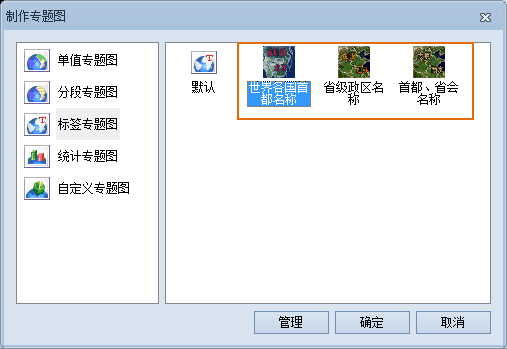

---
id: LabelMap3DTemplate
title: 基于模板制作三维标签专题图  
---  
### 使用说明

“ **制作专题图** ”功能界面右侧列表中，除“ **默认**
”项以外的选项，是基于已有的三维标签专题图的模板，为矢量数据集类型的三维图层制作三维标签专题图。

### 操作步骤

1. 设置要制作三维标签专题图的矢量数据集类型的三维图层（除文本数据集类型的三维图层外）为当前图层。   
  

2. 单击功能区“ **场景** ”选项卡上“ **数据** ”组中的“ **专题图** ”按钮。 
3. 在弹出的“ **制作专题图** ”功能界面的右侧区域，选择要基于的专题图模板即可应用模板中的风格制作出三维标签专题图。
4. 制作的三维标签专题图自动添加到当前场景中作为一个专题图层显示，同时在图层管理器中的“普通图层”结点下将增加一个子结点，该结点对应刚刚制作的专题图。
5. 系统自带的专题图模板和用户自定义的专题图模板都会出现在“ **制作专题图** ”功能界面右侧区域中，，可以通过模板管理器统一进行管理，请参见：[“模板管理”](LabelMap3DTemplateManager)。

### 注意事项

使用“模板”
完成标签专题图制作后，同时会弹出“三维标签专题图”窗口，窗口中显示了制作当前专题图的设置信息，用户可以对这些设置进行修改。因此，用户可以修改基于模板制作的标签专题图，从而获得更为理想的三维标签专题图。

###  相关主题

 [新建三维标签专题图](LabelMap3DDefault)

 [修改三维标签专题图](LabelMap3DGroupDia)

 [保存到专题图模板库](Theme_SaveThemeTempl)

