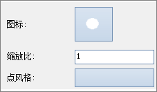
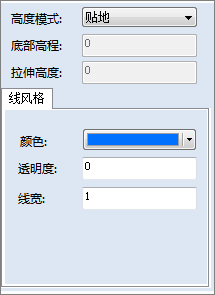
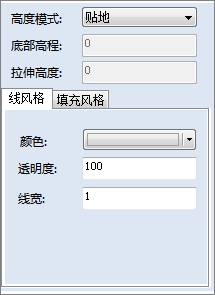
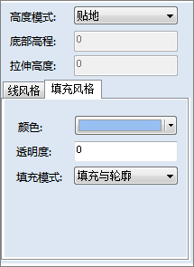

---
id: RangesMap3DSymbol
title: 设置符号风格对话框  
---  
### 点风格设置对话框

下图为点风格设置对话框，用于设置点对象的显示风格：   

  
---  
* **高度模式：** 设置点对象使用的高度模式，有关高度模式，请参见:[高度模式](../AdvancedLayserSetting/AltitudeMode) 中关于高度模式的详细介绍。
* **底部高程：** 设置点对象所放置的高度，即对象所在的高程位置。
* **拉伸高度：** 该项可以对点对象进行垂直拉伸，拉伸的高度通过该项进行设置。点对象被拉伸后，将显示一条牵引线，牵引线垂直于地表，牵引线的方向为从点对象的底部高程位置处向远离地表（拉伸高度为正值）或者向球心（拉伸高度为负值），牵引线的长度为拉伸高度的绝对值。

  注意：底部高程/拉伸高度只有在高度模式为非贴地模式时，设置才有效。

* **图标：** 设置点符号所使用的图标文件，即通过指定的图标文件来代表图层中的点符号，设置方式为：
    1. 单击“图标”右侧的按钮；
    2. 弹出“打开地标图标文件”对话框，在这里选择一个地标图标文件（*.png、*.jpg、*.jpeg、*.bmp），单击对话框中的“打开”按钮。
* **颜色：** 设置点符号的显示颜色。通过单击右侧的颜色按钮，在弹出的颜色面板中选择和设置点符号的颜色。
* **透明度：** 设置点符号的透明效果。通过在其右侧的文本框中输入数值来设置。输入数值的范围为 0 至 100 之间的整数值，100 代表完部全透明；0代表完全不透明。
* **大小：** 设置点符号的显示大小。通过在其右侧的文本框中输入数值来设置，符号大小的数值单位为：像素。
* **缩放比：** 当采用图标来代替点符号时，该项用来设置图标的缩放比率。通过在其右侧的文本框中输入数值来设置，数值单位为：百分比（%）。

### 线风格设置对话框

下图为线风格设置对话框，用于设置线对象的显示风格：       
        
* **高度模式：** 设置线对象使用的高度模式，有关高度模式，请参见:[高度模式](../AdvancedLayserSetting/AltitudeMode) 中关于高度模式的详细介绍。
* **底部高程：** 设置线对象所放置的高度，即对象所在的高程位置。
* **拉伸高度：** 该项可以对线对象进行垂直拉伸，拉伸的高度通过该项进行设置。线对象被拉伸后，将产生垂直于地表的面。
注意：底部高程/拉伸高度只有在高度模式为非贴地模式时，设置才有效。

* **颜色：** 设置线对象或者线对象被垂直拉伸后所产生的面对象的轮廓线的显示颜色。通过单击右侧的颜色按钮，在弹出的颜色面板中选择和设置线的颜色。
* **透明度：** 设置线对象或者线对象被垂直拉伸后所产生的面对象的轮廓线的透明效果。通过在其右侧的文本框中输入数值来设置。输入数值的范围为 0 至 100 之间的整数值，100 代表完全透明；0代表完全不透明。
* **线宽：** 设置线对象或者线对象被垂直拉伸后所产生的面对象的轮廓线的线宽。通过在其右侧的文本框中输入数值来设置，线宽的数值单位为：像素。 

### 填充风格设置对话框

下图为填充风格设置对话框，用于设置面对象的显示风格。对话框有两个选项卡：（1）“线风格”选项卡，用来设置面对象的边框风格；（2）“填充风格”选项卡，用来设置面对象的填充风格。   

   
* **高度模式：** 设置面对象使用的高度模式，有关高度模式，请参见:[高度模式](../AdvancedLayserSetting/AltitudeMode) 中关于高度模式的详细介绍。
* **底部高程：** 设置面对象所放置的高度，即对象所在的高程位置。
* **拉伸高度：** 该项可以对面对象进行垂直拉伸为三维体对象，拉伸的高度通过该项进行设置。

  注意：底部高程/拉伸高度只有在高度模式为非贴地模式时，设置才有效。

### “线风格”选项卡：

* **颜色：** 设置面对象的轮廓线或者面对象被垂直拉伸后产生的体对象的轮廓线的显示颜色。通过单击右侧的颜色按钮，在弹出的颜色面板中选择和设置线的颜色。
* **透明度：** 设置面对象的轮廓线或者面对象被垂直拉伸后产生的体对象的轮廓线的透明效果。通过在其右侧的文本框中输入数值来设置。输入数值的范围为 0 至 100 之间的整数值，100 代表完全透明；0代表完全不透明。
* **线宽：** 设置面对象的轮廓线或者面对象被垂直拉伸后产生的体对象的轮廓线的线宽。通过在其右侧的文本框中输入数值来设置，线宽的数值单位为：像素。 

### “填充风格”选项卡：

* **颜色：** 设置面对象或者面对象被拉伸为体对象后产生的其他面的填充颜色。通过单击右侧的颜色按钮，在弹出的颜色面板中选择和设置线的颜色。
* **透明度：** 设置面对象或者面对象被拉伸为体对象后产生的其他面的填充透明效果。通过在其右侧的文本框中输入数值来设置。输入数值的范围为 0 至 100 之间的整数值，100 代表完全透明；0代表完全不透明。
* **填充模式：** 设置面对象或者面对象被拉伸为体对象后产生的其他面的填充模式。填充模式分为三种，分别为：

    **轮廓:** 只显示面的轮廓线（边框），而不显示面的填充内容。

    **填充:** 只显示面的填充内容，而不显示面的轮廓线（边框）。

    **填充与轮廓:** 面的轮廓线（边框）和面的填充内容同时显示。

