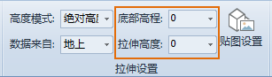

“ **风格设置** ”选项卡的“ **拉伸设置** ”组，对加载进场景的二维矢量数据提供改变底部高程、模型拉伸等功能。  
  
  
### 底部高程

在场景中的矢量数据集类型的三维图层中，所有对象按照其经纬度坐标显示在相应的位置。

通过“底部高程”标签右侧的组合框可以设置对象所在位置距离地球表面的高程值。

### 拉伸高度

在场景中可以对矢量数据集类型的三维图层中的二维几何对象进行垂直拉伸。

通过“拉伸高度”标签右侧的组合框可设置对象从底部高程位置起算，在垂直地球表面方向拉伸的高度。

**操作步骤**

1. 在拉伸高度/底部高程标签右侧的组合框中输入适当的数值，则选中的矢量数据集类型的三维图层中所有对象以设置的相应拉伸高度/底部高程数值进行三维渲染。
2. 组合框的下拉列表中，列出了选中的矢量数据集类型的三维图层的数据集属性表中所有的数值类型的字段，选中某一个字段，则三维图层中对象的拉伸高度/底部高程即可设置为指定字段的值。

**注意事项**

只有当当前图层为矢量数据集类型的图层，且“风格设置”选项卡“拉伸设置”组中的“高度模式”设置为非贴地模式时，“拉伸设置”组中的其他功能控件才可使用，各项设置才有效。

 

