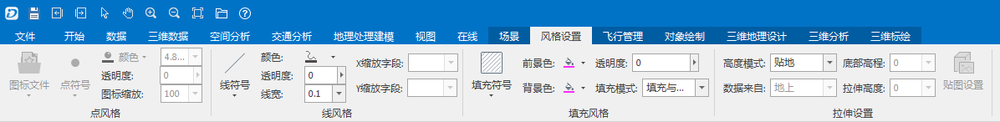

---
id: Style3DTab
title: 三维符号化表达  
---  
这部分主要介绍如何对场景中矢量图层的风格进行设置，以达到更好的表达效果。这部分功能主要通过“风格设置”选项卡进行实现。不仅支持对添加到场景中的矢量数据集（包括点、线、面数据集、网络数据集、路由数据集），也支持对场景矢量缓存图层进行三维图层风格设置，场景矢量缓存图层支持三维点、线、面符号设置。

用户可通过“风格设置”选项卡的功能项来设置场景中的图层风格，也可以在“图层管理器”选中图层，单击右键，选择“图层风格…”选项来设置场景中的图层风格。

  
  
### 内容提要：

 [设置矢量图层的风格](Vector3Dgroup)

 [快速建模](SceneQuickModel)

